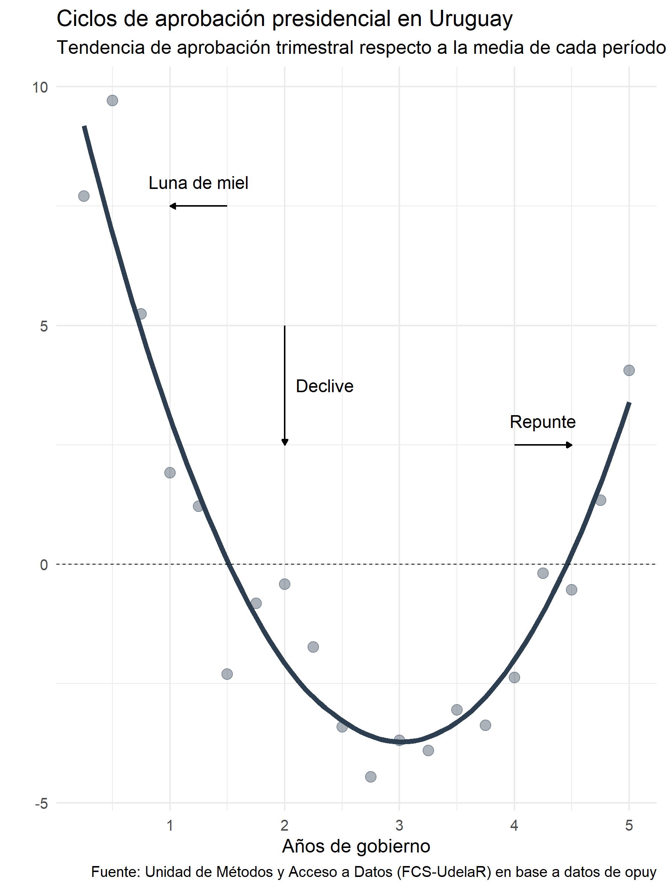
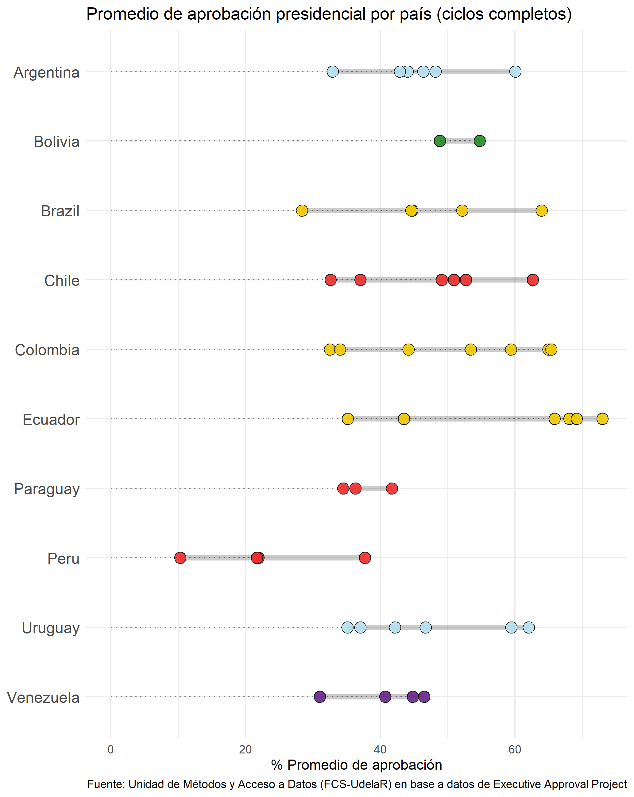
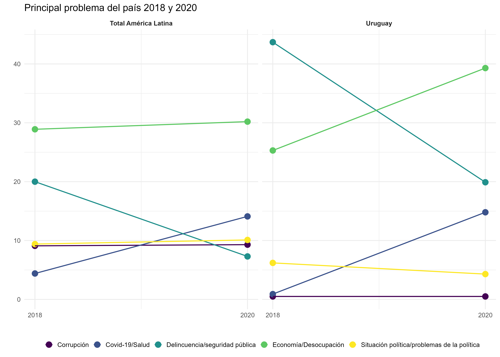

```{r setup, include=FALSE}
knitr::opts_chunk$set(echo = FALSE, warning = FALSE, message = FALSE)
```


```{r, echo=FALSE}
htmltools::img(src = knitr::image_uri("www/logo_umad.png"), 
               alt = 'logo', 
               style = 'position:absolute; top:0; right:0; padding:15px;max-width: 45%;')

library(tidyverse)
library(DT)
library(kableExtra)
library(downloadthis)
library(knitr)
library(opuy)
library(ggridges)
```

<br />
<br />

<div style="text-align: justify">
**La [Unidad de Métodos y Acceso a Datos](https://umad.cienciassociales.edu.uy/) (UMAD) (FCS-UdelaR) a partir del [Observatorio Uruguay](https://umad.cienciassociales.edu.uy/observatorio-uruguay/) busca aportar a la difusión de conocimiento respecto a temas de interés general sobre la realidad social, económica y política del Uruguay. Esta serie de documentos tiene como objetivo presentar indicadores clave para el análisis de tendencias históricas del país que esperamos sean de utilidad para las comunidades académicas, los tomadores de decisión y los formadores de opinión, así como el público en general. Se presentan aquí indicadores de opinión pública provenientes de encuestadoras locales y proyectos de opinión pública internacionales **
</div>

<br />

<hr style="border:1.5px solid #2c3e50"> </hr>

# **Opinión pública en Uruguay**

<div style="text-align: justify">

Las primeras encuestas de opinión pública en Uruguay de las que existe regristo datan alrededor de 1956 generando incluso una fuerte presencia en los diarios de la época hacia fines de la década del 1950 y 1960 ([Aguiar, 2000](https://dialnet.unirioja.es/servlet/articulo?codigo=3162414)). Incluso algunas de estas encuestas llevadas a cabo principalmente por la empresa Gallup están disponibles en el archivo de datos de ciencias sociales [**Roper Center**](https://ropercenter.cornell.edu/) de la Universidad de Cornell. Sin embargo, es a principio de los 90s que comienzan los estudios sistemáticos a nivel nacional de opinión pública -que cuentan con series históricas de preguntas realizadas hasta el día de hoy- en nuestro país ([Zuasnábar, 2018](https://dialogopolitico.org/wp-content/uploads/2018/08/libro_30_anios_de_opinion_publica_en_el_uruguay.pdf)). Hacia finales de la década de 1990 las consultoras [**Equipos**](https://equipos.com.uy/), [**Cifra**](https://www.cifra.com.uy/), [**Factum**](https://factum.uy/) e Interconsult y [**Radar**](https://www.gruporadar.com.uy/) a la que sumaría [**Opción Consultores**](https://www.opcion.com.uy/) en la década de 2010 realizan periódicamente encuestas de opinión pública para diversos actores en nuestro país, frecuentemente difundidas en medios de comunicación. Los datos agregados tanto de intención de voto como de aprobación presidencial fueron recolectados por la [UMAD](https://umad.cienciassociales.edu.uy/) y están disponibles en el paquete de R [**opuy**](https://github.com/Nicolas-Schmidt/opuy)).

A su vez, existen proyectos de opinión pública internacionales que realizan encuestas de opinión pública en Uruguay y habilitan acceso a los microdatos. Estos proyetos aplican los mismos -o muy similares- cuestionarios en distintos países de la región o el mundo facilitando los estudios comparados de opinión pública entre países. El proyecto de más larga data es [**Latinobarómetro**](https://www.latinobarometro.org/lat.jsp) que ha realizado 21 encuestas en nuestro país entre 1995 y 2020, realizando también encuestas en otros 17 países latinoamericanos y España. A su vez, el [**Barómetro de las Américas**](https://www.vanderbilt.edu/lapop-espanol/acerca-americasbarometer.php) de [**LAPOP**](https://www.vanderbilt.edu/lapop-espanol/) de la Universidad de Vanderbilt realiza encuestas periódicamente desde 2006 en nuestro país y otros países de la región y fuera de la región también. A su vez, otros proyectos internacionales que ocasionalmente realizan encuestas de opinión pública en Uruguay son la [**Encuesta Mundial de Valores**](https://www.worldvaluessurvey.org/WVSNewsShow.jsp?ID=249) (1996, 2006 y 2011) y el [**Comparative Study of Electoral Systems**](https://cses.org/) (2009 y 2019)
</div>

## **Guía de uso**

Hablar de margen de error, diferentes question wordings, etc.

<br />

<hr style="border:1.5px solid #2c3e50"> </hr>

# **Evaluación presidencial**

<div style="text-align: justify">
**La evaluación presidencial** es uno de los indicadores más utilizados en el estudio de la opinión pública en sistemas presidencialistas y releva cómo la opinión pública evalúa la gestión del presidente. Entre otros motivos, la aprobación presidencial es importante en sistemas presidencialistas porque los presidentes pueden utilizar las evaluaciones que la opinión pública como una guía para ajustar sus programas ([Carlin et al., 2015](https://link.springer.com/content/pdf/10.1007/s11109-014-9267-3.pdf)). De esta forma, la aprobación presidencial funciona como un mecanismo de **accountability** o rendición de cuentas que el electorado posee para reaccionar frente a las decisiones del presidente. Entre otras consecuencias, existe evidencia para América Latina de que una eleveda aprobación presidencial aumenta la probabilidad de pasar legistlatura de forma satisfactoria ([Calvo, 2007](https://www.cambridge.org/core/journals/british-journal-of-political-science/article/abs/responsive-legislature-public-opinion-and-law-making-in-a-highly-disciplined-legislature/276D8A3A06B1D7C6BE21727001A1C1E2)), contribuye a gobiernos más estables ([Martinez-Gallardo, 2012](https://journals.sagepub.com/doi/full/10.1177/0010414011421306?casa_token=-zuTBbxYm3wAAAAA%3AJs4Fcdxpwd4wf_fD-Mp2milTkmAdg_0MOVitwf9_qH_UIdCT7ROy0VrxF4nXoG7Tkn4UKN4qU4Z_zQ)) y aumenta la probabilidad de los presidentes de terminar sus mandatos ([Perez-Liñán, 2007](https://books.google.es/books?hl=es&lr=&id=ha-HeVpSrmkC&oi=fnd&pg=PR12&dq=P%C3%A9rez-Li%C3%B1%C3%A1n,+2007&ots=T2fe0iNkuq&sig=BgQ23zlZ6iMVjgertUHjMTeBPto#v=onepage&q=P%C3%A9rez-Li%C3%B1%C3%A1n%2C%202007&f=false)).
</div>

<br>

<div class="boxed">
**La evaluación del presidente en Uruguay se releva releva a nivel nacional de forma ininterrumpida fines de la década de 1980 por consultoras de opinión pública locales. El fraseo de la pregunta suele ser alguna variación de** *"¿Ud. aprueba o desaprueba la forma en que se está desempeñando el Presidente?"*.  
</div>

<br />

## **Ciclos de aprobación presidencial**

```{r , echo=FALSE, out.width= "55%", out.extra='style="float:right; padding:5px"'}

```

<div style="text-align: justify">
La aprobación presidencial suele -aunque no siempre- mostrar un **patrón cíclico** con forma de tick invertido, divido en tres etapas ([Stimson, 1976](https://academic.oup.com/poq/article-abstract/40/1/1/1836685); [Carlin et al., 2018](https://journals.sagepub.com/doi/full/10.1177/2053168018787690)): 
<ol>
  <br />
  <li>**Luna de miel**: los primeros meses de mandato suele ser el período donde el presidente obtiene mayor aprobación </li>
  <br />
  <li>**Deterioro**: posterior a la luna de miel, usualmente antes de cumplido el primer año del mandato, suele existir un declive gradual de la aprobación hasta cerca del año antes del término de su mandato. </li>
  <br />
  <li>**Recupero final**: en los últimos meses del mandato y previo a la próxima elección, la aprobación del presidente suele recuperarse, aunque sin alcanzar los niveles de la luna de miel. Uruguay es el país en América Latina que suele tener los repuntes más altos ([Carlin et al., 2018](https://journals.sagepub.com/doi/full/10.1177/2053168018787690)) </li>
</ol>
</div>

<br />

## **Serie histórica de aprobación**

<div style="text-align: justify">
Como se menciona en la guía de uso, es necesario tener ciertos recabos al agregar datos de diferentes encuestas. Las consultoras de opinión pública que publican datos de evaluación del presidente suelen diferir en el fraseo de la pregunta, método de administración o esquema de ponderación. De esta forma, es necesario ser cauteloso al interpretar diferencias entre dos encuestas realizadas de forma distinta, dado que el error **no muestral** puede causar diferencias mayores al margen de error teórico. 

Para poder analizar el cambio en el tiempo de la evaluación del presidente presentamos los datos de tres maneras, para que el usuario pueda utilizar la que más se ajuste a sus necesidades (se puede acceder a los datos completos a través del paquete de R [**opuy**](https://github.com/Nicolas-Schmidt/opuy): **(1)** calculamos la tendencia utilizando todos los datos disponibles en [**opuy**](https://github.com/Nicolas-Schmidt/opuy) mediante una regresión local (loess); **(2)** combinamos los datos de las series de cada encuestadora utilizando el algoritmo de *dyads-ratio* para estimar una sola serie; **(3)** presentamos la serie con los datos de la consultora con mayor cantidad de encuestas -en este caso Equipos-. Cada estrategia de análisis tiene ventajas y desventajas que deben ser consideradas al emplear estos datos una investigación. 
</div>

<br />

### **1. Datos crudos de todas las fuentes**

<div style="text-align: justify">
Los datos de evaluación del presidente disponibles en [**opuy**](https://github.com/Nicolas-Schmidt/opuy) conforman distintas series que no son estrictamente comparables, es decir, la serie de una consultora puede presentar de forma sistemática evaluaciones superiores o inferiores a la de otra consultora debido a los métodos utilizados (método de administración, pregunta, categorías de respuesta, esquema de ponderación, etc.). Por esto desaconsejamos el uso lineal de los datos combinados, y simplemente presentamos una **línea de tendencia** -estimada con una regresión local- que permite estimar a grandes rasgos los niveles absolutos de evaluación en cada período y la variación en cada período.

Los gráficos debajo muestran datos para 7 períodos presidenciales aunque solo existe información para todo el perído entre el segundo gobierno de Sanguinetti y el segundo gobierno de Vázquez. 4 de las 5 administraciones para las que tenemos datos del período completo se ajustan al ciclo típico de aprobación presidencial: luna de miel, declive y repunte final, con la excepción del segundo gobierno de Sanguinetti, que muestra un repunte final pero no una luna de miel. 
</div>

### {.tabset .tabset-fade .tabset-pills}

#### **Gráfico (% aprobación)**

```{r, echo=FALSE, fig.width=10, fig.height=5, fig.align="center"}
# Descargar y manipular data desde opuy
dat_opuy <- opuy %>%
  filter(medicion == 'Evaluacion de gestion presidente',
         categoria_unificada == 3) %>%
  select(fecha, empresa, valor, presidente) %>%
  mutate(presidente = factor(presidente, 
                             levels = c("Lacalle", "Sanguinetti 2", "Batlle",
                                        "Vazquez 1", "Mujica", "Vazquez 2",
                                        "Lacalle Pou"))) 

# Anotaciones
annotation <- data.frame(
  x = as.Date(c( "1992-01-01","1997-06-06", "2002-06-06", "2007-06-06", 
                 "2012-06-06", "2017-06-06", "2022-01-01")),
  y = 85,
  label = c("Lacalle","Sanguinetti II", "Batlle", "Vázquez I", "Mujica",
            "Vázquez II", "Lacalle Pou"))

fechas <- as.Date(c("1995-01-01","2000-01-01", "2005-01-01",
                    "2010-01-01", "2015-01-01", "2020-01-01"))


# Grafico
aprob_serie <- dat_opuy %>%
  ggplot(aes(x = fecha, y = valor, color = presidente)) +
  geom_smooth(aes(group = presidente), method ="loess", se = FALSE) +
  geom_point(size = 1.5, alpha = 0.3) +
  geom_vline(xintercept = as.numeric(fechas),
             linetype = "dashed", size = 0.3, color = "grey30") +
  geom_text(data = annotation, aes(x = x, y = y, label = label),
            color = "black", size = 3) +
  theme_minimal(base_size = 10) +
  theme(legend.position = "none") +
  labs(y = "% de aprobación",
       x = "",
       title = "Serie histórica de aprobación del presidente",
       caption = 'Fuente: Unidad de Métodos y Acceso a Datos (FCS-UdelaR) en base a datos de opuy 
       Datos originales de Equipos, Cifra, Factum, Opción, Interconsult y Radar') +
  scale_color_manual(name = "",
                     values = c("#5DADE2", "#BA0200", "#BA0200", "#013197",
                                "#013197", "#013197", "#5DADE2")) +
  scale_x_date(date_breaks = "2 years", date_minor_breaks = "1 year",
               date_labels = "%Y", limits = c(as.Date("1990-01-01"), NA))   

plot(aprob_serie)
```

```{r}
download_this(aprob_serie,
              button_label = "Descargar gráfico",
              icon = "fa fa-download")
```

#### **Gráfico (saldo neto)**

```{r, echo=FALSE, fig.width=10, fig.height=5, fig.align="center"}
# Descargar y manipular data desde opuy
dat_opuy <- opuy %>%
  filter(medicion == 'Evaluacion de gestion presidente') %>%
  select(fecha, anio_gobierno, empresa, valor, presidente, categoria_unificada)  %>%
  mutate(categoria_unificada = case_when(
    categoria_unificada == 3 ~ "Aprueba",  
    categoria_unificada == 2 ~ "Ni aprueba ni desaprueba",
    categoria_unificada == 1 ~ "Desaprueba",
    categoria_unificada == 0 ~ "NSNC")) %>%
  pivot_wider(names_from = categoria_unificada, values_from = valor) %>% 
  mutate(Saldo = Aprueba - Desaprueba) %>% 
  mutate(presidente = factor(presidente, 
                             levels = c("Lacalle", "Sanguinetti 2", "Batlle",
                                        "Vazquez 1", "Mujica", "Vazquez 2",
                                        "Lacalle Pou")))
# Anotaciones
annotation <- data.frame(
  x = as.Date(c( "1992-01-01","1997-06-06", "2002-06-06", "2007-06-06", 
                 "2012-06-06", "2017-06-06", "2022-01-01")),
  y = 85,
  label = c("Lacalle","Sanguinetti II", "Batlle", "Vázquez I", "Mujica",
            "Vázquez II", "Lacalle Pou"))

fechas <- as.Date(c("1995-01-01","2000-01-01", "2005-01-01",
                    "2010-01-01", "2015-01-01", "2020-01-01"))


# Grafico
aprob_serie_s <- dat_opuy %>%
  ggplot(aes(x = fecha, y = Saldo, color = presidente)) +
  geom_smooth(aes(group = presidente), method ="loess", se = FALSE) +
  geom_point(size = 1.5, alpha = 0.3) +
  geom_vline(xintercept = as.numeric(fechas),
             linetype = "dashed", size = 0.3, color = "grey30") +
  geom_hline(yintercept = 0, size = 0.3) +
  geom_text(data = annotation, aes(x = x, y = y, label = label),
            color = "black", size = 3) +
  annotate("segment", x = as.Date("1990-01-01"), y = 10, xend = as.Date("1990-01-01"), yend = 25,
           arrow = arrow(type = "closed", length = unit(0.01, "npc"))) +
  annotate("text",
           label = "Evaluaciones \n positivas",
           x = as.Date("1992-06-01"), 
           y = 15,
           size = 3) +
  annotate("segment", x = as.Date("1990-01-01"), y = -10, xend = as.Date("1990-01-01"), yend = -25,
           arrow = arrow(type = "closed", length = unit(0.01, "npc"))) +
  annotate("text",
           label = "Evaluaciones \n negativas",
           x = as.Date("1992-06-01"), 
           y = -15,
           size = 3) +
  theme_minimal(base_size = 10) +
  theme(legend.position = "none") +
  labs(y = "Saldo neto",
       x = "",
       title = "Serie histórica de evaluación del presidente",
       subtitle = "Saldo neto = (% aprobación - % desaprobación)",
       caption = 'Fuente: Unidad de Métodos y Acceso a Datos (FCS-UdelaR) en base a datos de opuy
       Datos originales de Equipos, Cifra, Factum, Opción, Interconsult y Radar') +
  scale_color_manual(name = "",
                     values = c("#5DADE2", "#BA0200", "#BA0200", "#013197",
                                "#013197", "#013197", "#5DADE2")) +
  scale_x_date(date_breaks = "2 years", date_minor_breaks = "1 year",
               date_labels = "%Y", limits = c(as.Date("1990-01-01"), NA))   

plot(aprob_serie_s)
```

```{r}
download_this(aprob_serie_s,
              button_label = "Descargar gráfico",
              icon = "fa fa-download")
```


#### **Tabla**

```{r}
DT::datatable(dat_opuy %>%
                select(-anio_gobierno) %>% 
                arrange(desc(fecha)),
              extensions =  'Buttons',
              options =  list(dom = 'Bfrtip',
                              buttons = c('copy', 'csv', 'excel', 'print')))
```

#### **Código en R**

```{r, echo=TRUE, eval=FALSE}
## Instalar en caso de ser necesario
# install.packages("tidyverse")
# remotes::install_github("Nicolas-Schmidt/opuy")

library(opuy)
library(tidyverse)

# Descargar data desde opuy y crear tabla
dat_opuy <- opuy %>%
  filter(medicion == 'Evaluacion de gestion presidente') %>%
  select(fecha, anio_gobierno, empresa, valor, presidente, categoria_unificada)  %>%
  mutate(categoria_unificada = case_when(
    categoria_unificada == 3 ~ "Aprueba",  
    categoria_unificada == 2 ~ "Ni aprueba ni desaprueba",
    categoria_unificada == 1 ~ "Desaprueba",
    categoria_unificada == 0 ~ "NSNC")) %>%
  pivot_wider(names_from = categoria_unificada, values_from = valor) %>% 
  mutate(Saldo = Aprueba - Desaprueba) %>% 
  mutate(presidente = factor(presidente, 
                             levels = c("Lacalle", "Sanguinetti 2", "Batlle",
                                        "Vazquez 1", "Mujica", "Vazquez 2",
                                        "Lacalle Pou")))

# Anotaciones para gráfico
annotation <- data.frame(
  x = as.Date(c( "1992-01-01","1997-06-06", "2002-06-06", "2007-06-06", 
                 "2012-06-06", "2017-06-06", "2022-01-01")),
  y = 85,
  label = c("Lacalle","Sanguinetti II", "Batlle", "Vázquez I", "Mujica",
            "Vázquez II", "Lacalle Pou"))

fechas <- as.Date(c("1995-01-01","2000-01-01", "2005-01-01",
                    "2010-01-01", "2015-01-01", "2020-01-01"))


# Grafico % aprobación
aprob_serie <- dat_opuy %>%
  ggplot(aes(x = fecha, y = Aprueba, color = presidente)) +
  geom_smooth(aes(group = presidente), method ="loess", se = FALSE) +
  geom_point(size = 1.5, alpha = 0.3) +
  geom_vline(xintercept = as.numeric(fechas),
             linetype = "dashed", size = 0.3, color = "grey30") +
  geom_text(data = annotation, aes(x = x, y = y, label = label),
            color = "black", size = 3, fontface = "bold") +
  theme_minimal(base_size = 10) +
  theme(legend.position = "none") +
  labs(y = "% de aprobación",
       x = "",
       title = "Serie histórica de aprobación del presidente",
       caption = 'Fuente: Unidad de Métodos y Acceso a Datos (FCS-UdelaR) en base a datos de opuy \n 
       Datos originales de Equipos, Cifra, Factum, Opción, Interconsult y Radar') +
  scale_color_manual(name = "",
                     values = c("#5DADE2", "#BA0200", "#BA0200", "#013197",
                                "#013197", "#013197", "#5DADE2")) +
  scale_x_date(date_breaks = "2 years", date_minor_breaks = "1 year",
               date_labels = "%Y", limits = c(as.Date("1990-01-01"), NA))   

plot(aprob_serie)

# Grafico saldo neto
aprob_serie_s <- dat_opuy %>%
  ggplot(aes(x = fecha, y = Saldo, color = presidente)) +
  geom_smooth(aes(group = presidente), method ="loess", se = FALSE) +
  geom_point(size = 1.5, alpha = 0.3) +
  geom_vline(xintercept = as.numeric(fechas),
             linetype = "dashed", size = 0.3, color = "grey30") +
  geom_hline(yintercept = 0, size = 0.3) +
  geom_text(data = annotation, aes(x = x, y = y, label = label),
            color = "black", size = 3) +
  annotate("segment", x = as.Date("1990-01-01"), y = 10, xend = as.Date("1990-01-01"), yend = 25,
           arrow = arrow(type = "closed", length = unit(0.01, "npc"))) +
  annotate("text",
           label = "Evaluaciones \n positivas",
           x = as.Date("1992-06-01"), 
           y = 15,
           size = 3) +
  annotate("segment", x = as.Date("1990-01-01"), y = -10, xend = as.Date("1990-01-01"), yend = -25,
           arrow = arrow(type = "closed", length = unit(0.01, "npc"))) +
  annotate("text",
           label = "Evaluaciones \n negativas",
           x = as.Date("1992-06-01"), 
           y = -15,
           size = 3) +
  theme_minimal(base_size = 10) +
  theme(legend.position = "none",
        title = element_text(face = "bold")) +
  labs(y = "Saldo neto",
       x = "",
       title = "Serie histórica de evaluación del presidente",
       subtitle = "Saldo neto = (% aprobación - % desaprobación)",
       caption = 'Fuente: Unidad de Métodos y Acceso a Datos (FCS-UdelaR) en base a datos de opuy \n 
       Datos originales de Equipos, Cifra, Factum, Opción, Interconsult y Radar') +
  scale_color_manual(name = "",
                     values = c("#5DADE2", "#BA0200", "#BA0200", "#013197",
                                "#013197", "#013197", "#5DADE2")) +
  scale_x_date(date_breaks = "2 years", date_minor_breaks = "1 year",
               date_labels = "%Y", limits = c(as.Date("1990-01-01"), NA))   

plot(aprob_serie_s)
```


## {.toc-ignore .unlisted .unnumbered}

<div style="text-align: justify">
Por otra parte, los gráficos debajo resume mediante diagramas de caja (aunque manteniendo el valor de cada encuesta, con error aleatorio en el eje horizontal para mejorar la visualización) la distribución tanto del % de aprobación como del saldo neto, para los gobiernos donde tenemos datos para la totalidad del período. El primer gobierno de Vázquez junto al gobierno de Mujica son los gobiernos con mayor aprobación presidencial. El gobierno de Batlle es el que presenta mayor variación, con niveles de aprobación cercanos al 50% al comienzo pero alvanzando los niveles más bajos de los que hay registro, cercanos al 10% de aprobación.
</div>

### {.tabset .tabset-fade .tabset-pills}

#### **Gráfico (% aprobación)**

```{r, echo=FALSE, fig.width=10, fig.height=5, fig.align="center"}
# Descargar y manipular data desde opuy
dat_opuy <- opuy %>%
  filter(medicion == 'Evaluacion de gestion presidente') %>%
  select(fecha, anio_gobierno, empresa, valor, presidente, categoria_unificada)  %>%
  mutate(categoria_unificada = case_when(
    categoria_unificada == 3 ~ "Aprueba",  
    categoria_unificada == 2 ~ "Ni aprueba ni desaprueba",
    categoria_unificada == 1 ~ "Desaprueba",
    categoria_unificada == 0 ~ "NSNC")) %>%
  pivot_wider(names_from = categoria_unificada, values_from = valor) %>% 
  mutate(Saldo = Aprueba - Desaprueba) %>% 
  mutate(presidente = factor(presidente, 
                             levels = c("Lacalle", "Sanguinetti 2", "Batlle",
                                        "Vazquez 1", "Mujica", "Vazquez 2",
                                        "Lacalle Pou")))

# Boxplot aprobación
promedio_aprob <- ggplot(dat_opuy %>% 
         filter(presidente != "Lacalle Pou"),
       aes(x = presidente, y = Aprueba)) +
  geom_boxplot(aes(fill = presidente), outlier.shape = NA, lwd = 1, alpha = 0.4) +
  geom_jitter(aes(color = presidente), size = 2, alpha = 0.5) +
  theme_minimal() +
  theme(legend.position = "none") +
  labs(title = "Evaluación del presidente",
       subtitle = "Diagrama de caja, % de aprobación",
       caption = 'Fuente: Unidad de Métodos y Acceso a Datos (FCS-UdelaR) en base a datos de opuy  
       Datos originales de Equipos, Cifra, Factum, Opción, Interconsult y Radar',
       y = "% de Aprobación",
       x = "") +
  scale_color_manual(name = "",
                     values = c("#5DADE2", "#BA0200", "#BA0200", "#013197",
                                "#013197", "#013197", "#5DADE2")) +
  scale_fill_manual(name = "",
                     values = c("#5DADE2", "#BA0200", "#BA0200", "#013197",
                                "#013197", "#013197", "#5DADE2"))
plot(promedio_aprob)

```

```{r}
download_this(promedio_aprob,
              button_label = "Descargar gráfico",
              icon = "fa fa-download")
```

#### **Gráfico (saldo neto)**

```{r, echo=FALSE, fig.width=10, fig.height=5, fig.align="center"}
# Boxplot saldo neto
promedio_saldo <- ggplot(dat_opuy %>% 
         filter(presidente != "Lacalle Pou"),
       aes(x = presidente, y = Saldo)) +
  geom_boxplot(aes(fill = presidente), outlier.shape = NA, lwd = 1, alpha = 0.4) +
  geom_jitter(aes(color = presidente), size = 2, alpha = 0.5) +
  geom_hline(yintercept = 0, size = .3, linetype = "dashed") +
  theme_minimal() +
  theme(legend.position = "none") +
  labs(title = "Evaluación del presidente",
       subtitle = "Diagrama de caja, saldo neto",
       caption = 'Fuente: Unidad de Métodos y Acceso a Datos (FCS-UdelaR) en base a datos de opuy 
       Datos originales de Equipos, Cifra, Factum, Opción, Interconsult y Radar',
       y = "% de Aprobación",
       x = "") +
  scale_color_manual(name = "",
                     values = c("#5DADE2", "#BA0200", "#BA0200", "#013197",
                                "#013197", "#013197", "#5DADE2")) +
  scale_fill_manual(name = "",
                    values = c("#5DADE2", "#BA0200", "#BA0200", "#013197",
                               "#013197", "#013197", "#5DADE2"))

plot(promedio_saldo)
```

```{r}
download_this(aprob_serie_s,
              button_label = "Descargar gráfico",
              icon = "fa fa-download")
```


#### **Tabla**

```{r}
DT::datatable(dat_opuy %>%
                select(-anio_gobierno) %>% 
                arrange(desc(fecha)),
              extensions =  'Buttons',
              options =  list(dom = 'Bfrtip',
                              buttons = c('copy', 'csv', 'excel', 'print')))
```

#### **Código en R**

```{r, echo=TRUE, eval=FALSE}
## Instalar en caso de ser necesario
# install.packages("tidyverse")
# remotes::install_github("Nicolas-Schmidt/opuy")

library(opuy)
library(tidyverse)

# Descargar y manipular data desde opuy
dat_opuy <- opuy %>%
  filter(medicion == 'Evaluacion de gestion presidente') %>%
  select(fecha, anio_gobierno, empresa, valor, presidente, categoria_unificada)  %>%
  mutate(categoria_unificada = case_when(
    categoria_unificada == 3 ~ "Aprueba",  
    categoria_unificada == 2 ~ "Ni aprueba ni desaprueba",
    categoria_unificada == 1 ~ "Desaprueba",
    categoria_unificada == 0 ~ "NSNC")) %>%
  pivot_wider(names_from = categoria_unificada, values_from = valor) %>% 
  mutate(Saldo = Aprueba - Desaprueba) %>% 
  mutate(presidente = factor(presidente, 
                             levels = c("Lacalle", "Sanguinetti 2", "Batlle",
                                        "Vazquez 1", "Mujica", "Vazquez 2",
                                        "Lacalle Pou")))

# Distribución aprobación
ggplot(dat_opuy %>% 
         filter(presidente != "Lacalle Pou"),
       aes(x = presidente, y = Aprueba)) +
  geom_boxplot(aes(fill = presidente), outlier.shape = NA, lwd = 1, alpha = 0.4) +
  geom_jitter(aes(color = presidente), size = 2, alpha = 0.5) +
  theme_minimal() +
  theme(legend.position = "none") +
  labs(title = "Evaluación del presidente",
       subtitle = "Diagrama de caja, % de aprobación",
       caption = 'Fuente: Unidad de Métodos y Acceso a Datos (FCS-UdelaR) en base a datos de opuy  
       Datos originales de Equipos, Cifra, Factum, Opción, Interconsult y Radar',
       y = "% de Aprobación",
       x = "") +
  scale_color_manual(name = "",
                     values = c("#5DADE2", "#BA0200", "#BA0200", "#013197",
                                "#013197", "#013197", "#5DADE2")) +
  scale_fill_manual(name = "",
                     values = c("#5DADE2", "#BA0200", "#BA0200", "#013197",
                                "#013197", "#013197", "#5DADE2"))
```


## {.toc-ignore .unlisted .unnumbered}

### **2. Estimación mediante algoritmo de *dyad-ratios* **

Para obtener una estimación concreta que permita maximizar los datos de todas las fuentes sin comparar linealmente series de distintas consultoras, estimamos una dimensión latente de aprobación presidencial con el algoritmo de *dyad-ratios* siguiendo el enfoque del [Executive Approval Project](http://www.executiveapproval.org/datasets) (ver [Carlin et al., 2015](https://link.springer.com/content/pdf/10.1007/s11109-014-9267-3.pdf)). El algoritmo de dyad-ratios fue creado por James Stimson en 1991 y es parte fundamental del estudio temporal de la **opinión pública agregada**. El algoritmo funciona bajo el supuesto de que la proporción entre dos valores cualquiera dentro de una serie -en este caso series de evaluación del presidente de distintas consultoras, con sus diferencias metodológicas- son indicadores válidos de del cambio relativo en la **dimensión latente**. Si estos cambios relativos verdaderamente reflejan a una dimensión latente común, deberían variar en conjunto -por más detalles sobre el funcionamiento del algoritmo ver ([Stimson, 2018](https://journals.sagepub.com/doi/full/10.1177/0759106318761614?casa_token=JUMBIfc8wHwAAAAA%3A_cv6CzoFoZa5oikshf0djBOJ51JYtcvxx6I5zOLgyz9kvoRwe6gkLzfsugXQx1qMC7_ZUN9WbXC2tg))-. 

Los gráficos debajo musetran la estimación de la evaluación presidencial (tanto en % de aprobación como en saldo neto) para cada trimestre desde 1990 a 2021. La estimación explica el 90% de la varianza, al mismo tiempo que todas las series correlacionan de forma positiva con la estimación. La principal ventaja de este método nos permite obtener una **estimación concreta** para cada trimestre, maximizando la información de todas las fuentes. En términos generales la estimación trimestral también permite ver los patrones cíclicos de la evaluación presidencial, aunque evidenciando ciertas oscilaciones a mitad de mandato, por ejemplo Mujica alcanza su menor nivel de aprobación en el segundo trimestre del segundo año, Jorge Batlle durante la mitad del período (primer trimestre de 2003) mientras que el segundo gobierno de Vázquez obtiene su menor nivel de aprobación en el primer trimestre de su último año demandato.


### {.tabset .tabset-fade .tabset-pills}

#### **Gráfico (% aprobación)**
```{r, echo=FALSE, fig.width=10, fig.height=5, fig.align="center"}
serie_dr <- readxl::read_excel("data/aprob-dyad-ratio/serie_dyad_ratios.xlsx") %>% 
    mutate(quarter = zoo::as.yearqtr(format(quarter), "%Y Q%q"))

# Anotaciones para gráfico
annotation <- data.frame(
  x = fechas <- c(1992.25, 1997.25, 2002.25, 2007.25, 2012.25, 2017.25, 2022.25),
  y = 85,
  label = c("Lacalle","Sanguinetti II", "Batlle", "Vázquez I", "Mujica",
            "Vázquez II", "Lacalle Pou"))

fechas <- c(1994.85, 1999.85, 2004.85, 2009.85, 2014.85, 2019.85)

# Grafico % aprobación
plot_dr <- serie_dr %>%
  ggplot(aes(x = quarter, y = aprobacion, color = aprobacion)) +
  geom_line(size = 1) +
  geom_point(size = 2, alpha = 0.6) +
  geom_vline(xintercept = fechas,
             linetype = "dashed", size = 0.3, color = "grey30") +
  geom_text(data = annotation, aes(x = x, y = y, label = label),
            color = "black", size = 3) +
  theme_minimal(base_size = 10) +
  theme(legend.position = "none") +
  labs(y = "% de aprobación",
       x = "",
       title = "Serie histórica de aprobación del presidente",
       subtitle = "Cálculos sobre datos estimados mediante el algoritmo de dyads-ratio (% de aprobación)",
       caption = 'Fuente: Unidad de Métodos y Acceso a Datos (FCS-UdelaR) en base a datos de opuy  
       Datos originales de Equipos, Cifra, Factum, Opción, Interconsult y Radar') +
  scale_colour_gradient2(low = "firebrick2", mid = "gold2" , high = "forestgreen", 
                         midpoint = mean(serie_dr$aprobacion)) 

plot(plot_dr)
```

```{r}
download_this(plot_dr,
              button_label = "Descargar gráfico",
              icon = "fa fa-download")
```


#### **Gráfico (saldo neto)**

```{r, echo=FALSE, fig.width=10, fig.height=5, fig.align="center"}
# Grafico % aprobación
plot_dr_s <- serie_dr %>%
  ggplot(aes(x = quarter, y = saldo, color = saldo)) +
  geom_line(size = 1) +
  geom_point(size = 2, alpha = 0.6) +
  geom_hline(yintercept = 0) +
  geom_vline(xintercept = fechas,
             linetype = "dashed", size = 0.3, color = "grey30") +
  geom_hline(yintercept = 0, size = 0.3) +
  geom_text(data = annotation, aes(x = x, y = y, label = label),
            color = "black", size = 3) +
  annotate("segment", x = 1990.00, y = 30, xend = 1990.00, yend = 45,
           arrow = arrow(type = "closed", length = unit(0.01, "npc"))) +
  annotate("text",
           label = "Evaluaciones \n positivas",
           x = 1992.05, 
           y = 35,
           size = 3) +
  annotate("segment", x = 1990.00, y = -30, xend = 1990.00, yend = -45,
           arrow = arrow(type = "closed", length = unit(0.01, "npc"))) +
  annotate("text",
           label = "Evaluaciones \n negativas",
           x = 1992.05, 
           y = -35,
           size = 3) +
  theme_minimal(base_size = 10) +
  theme(legend.position = "none") +
  labs(y = "saldo neto",
       x = "",
       title = "Serie histórica de evaluación del presidente",
       subtitle = "Estimación utilizando el algoritmo de dyads-ratio (saldo neto)",
       caption = 'Fuente: Unidad de Métodos y Acceso a Datos (FCS-UdelaR) en base a datos de opuy  
       Datos originales de Equipos, Cifra, Factum, Opción, Interconsult y Radar') +
  scale_colour_gradient2(low = "firebrick2", mid = "gold2" , high = "forestgreen", 
                         midpoint = mean(serie_dr$saldo)) +
  ylim(-50, 90)

plot(plot_dr_s)

```

```{r}
download_this(plot_dr_s,
              button_label = "Descargar gráfico",
              icon = "fa fa-download")
```


#### **Tabla** 

```{r}
serie_dr <- readxl::read_excel("data/aprob-dyad-ratio/serie_dyad_ratios.xlsx")

DT::datatable(serie_dr %>%
                rename(trimestre = quarter) %>% 
                arrange(desc(trimestre)),
              extensions =  'Buttons',
              options =  list(dom = 'Bfrtip',
                              buttons = c('copy', 'csv', 'excel', 'print')))
```


#### **Código en R**

```{r, echo=TRUE, eval=FALSE}
## Instalar en caso de ser necesario
# install.packages("tidyverse")
# install.packages("zoo")
# remotes::install_github("Nicolas-Schmidt/opuy")

library(opuy)
library(tidyverse)

# Cargo la tabla (descargar de pestaña tabla)
serie_dr <- readxl::read_excel("data/aprob-dyad-ratio/serie_dyad_ratios.xlsx") %>% 
  mutate(quarter = zoo::as.yearqtr(format(quarter), "%Y Q%q"))

# Anotaciones para gráfico
annotation <- data.frame(
  x = fechas <- c(1992.25, 1997.25, 2002.25, 2007.25, 2012.25, 2017.25, 2022.25),
  y = 85,
  label = c("Lacalle","Sanguinetti II", "Batlle", "Vázquez I", "Mujica",
            "Vázquez II", "Lacalle Pou"))

fechas <- c(1994.85, 1999.85, 2004.85, 2009.85, 2014.85, 2019.85)

# Grafico % aprobación
plot_dr_a <- serie_dr %>%
  ggplot(aes(x = quarter, y = aprobacion, color = aprobacion)) +
  geom_line(size = 1) +
  geom_point(size = 2, alpha = 0.6) +
  geom_vline(xintercept = fechas,
             linetype = "dashed", size = 0.3, color = "grey30") +
  geom_text(data = annotation, aes(x = x, y = y, label = label),
            color = "black", size = 3) +
  theme_minimal(base_size = 10) +
  theme(legend.position = "none") +
  labs(y = "% de aprobación",
       x = "",
       title = "Serie histórica de aprobación del presidente",
       subtitle = "Estimación utilizando el algoritmo de dyads-ratio",
       caption = 'Fuente: Unidad de Métodos y Acceso a Datos (FCS-UdelaR) en base a datos de opuy  
       Datos originales de Equipos, Cifra, Factum, Opción, Interconsult y Radar') +
  scale_colour_gradient2(low = "firebrick2", mid = "gold2" , high = "forestgreen", 
                         midpoint = mean(serie_dr$aprobacion)) 

plot(plot_dr_a)

## Serie de saldo neto dyad-ratios 

# Grafico % aprobación
plot_dr_s <- serie_dr %>%
  ggplot(aes(x = quarter, y = saldo, color = saldo)) +
  geom_line(size = 1) +
  geom_point(size = 2, alpha = 0.6) +
  geom_hline(yintercept = 0) +
  geom_vline(xintercept = fechas,
             linetype = "dashed", size = 0.3, color = "grey30") +
  geom_hline(yintercept = 0, size = 0.3) +
  geom_text(data = annotation, aes(x = x, y = y, label = label),
            color = "black", size = 3) +
  annotate("segment", x = 1990.00, y = 30, xend = 1990.00, yend = 45,
           arrow = arrow(type = "closed", length = unit(0.01, "npc"))) +
  annotate("text",
           label = "Evaluaciones \n positivas",
           x = 1992.05, 
           y = 35,
           size = 3) +
  annotate("segment", x = 1990.00, y = -30, xend = 1990.00, yend = -45,
           arrow = arrow(type = "closed", length = unit(0.01, "npc"))) +
  annotate("text",
           label = "Evaluaciones \n negativas",
           x = 1992.05, 
           y = -35,
           size = 3) +
  theme_minimal(base_size = 10) +
  theme(legend.position = "none") +
  labs(y = "saldo neto",
       x = "",
       title = "Serie histórica de evaluación del presidente",
       subtitle = "Cálculos sobre datos estimados mediante el algoritmo de dyads-ratio (% de aprobación)",
       caption = 'Fuente: Unidad de Métodos y Acceso a Datos (FCS-UdelaR) en base a datos de opuy  
       Datos originales de Equipos, Cifra, Factum, Opción, Interconsult y Radar') +
  scale_colour_gradient2(low = "firebrick2", mid = "gold2" , high = "forestgreen", 
                         midpoint = mean(serie_dr$saldo)) +
  ylim(-50, 90)

plot(plot_dr_s)

```


## {.toc-ignore .unlisted .unnumbered}

Los gráficos debajo muestran la media de nuestra estimación trimestral para % de aprobación y saldo neto, con las barras de error representando la **desviación estandar**. Las medias de la aprobación trimestral presentan un escenario similar al descripto anteriormente, con el primer gobierno de Vázquez y el gobierno de Mujica como los de mayor aprobación, y un nivel simiilar para el segundo gobierno de Sanguinetti y Vázquez. A su vez, la administración de Batlle es la que presenta mayor desviación debido a su luna de miel con altos % de aprobación y su posterior marcado declive hasta posiciones mayoritariamente negativas.


### {.tabset .tabset-fade .tabset-pills}

#### **Gráfico (% aprobación)**
```{r, echo=FALSE, fig.width=10, fig.height=5, fig.align="center"}
# Cargo la tabla
serie_dr <- readxl::read_excel("data/aprob-dyad-ratio/serie_dyad_ratios.xlsx") %>% 
  mutate(quarter = zoo::as.yearqtr(format(quarter), "%Y Q%q"))

dat_promedio <- serie_dr %>% 
  mutate(presidencia = factor(presidencia, levels = c("Lacalle", "Sanguinetti II", 
                                                      "Batlle", "Vázquez I", "Mujica", 
                                                      "Vázquez II", "Lacalle Pou"))) %>%
  group_by(presidencia) %>% 
  filter(presidencia != "Lacalle Pou") %>% # Solo mandatos terminados
  summarize(aprob_m = round(mean(aprobacion), digits = 1),
            aprob_sd = round(sd(aprobacion), digits = 1),
            saldo_m = round(mean(saldo), digits = 1),
            saldo_sd = round(sd(saldo), digits = 1)) 


plot_promedio <- ggplot(data = dat_promedio,
       aes(x = presidencia, y = aprob_m, color = presidencia)) +
  geom_errorbar(aes(ymin = aprob_m - aprob_sd, ymax = aprob_m + aprob_sd), width=.1) +
  geom_point(size=3) +
  geom_text(aes(label = aprob_m),hjust = -.5, vjust = .5) +
  labs(title = "Promedio y desvío estandar de aprobación del presidente según administración",
       subtitle = "Estimación utilizando el algoritmo de dyads-ratio (% de aprobación)",
       caption = 'Fuente: Unidad de Métodos y Acceso a Datos (FCS-UdelaR) en base a datos de opuy  
       Datos originales de Equipos, Cifra, Factum, Opción, Interconsult y Radar',
       x = "",
       y = "") +
  theme_minimal(base_size = 10) +
  theme(legend.position = "none") +
  scale_color_manual(name = "",
                     values = c("#5DADE2", "#BA0200", "#BA0200", "#013197",
                                "#013197", "#013197", "#5DADE2")) 

plot(plot_promedio)
```

```{r}
download_this(plot_promedio,
              button_label = "Descargar gráfico",
              icon = "fa fa-download")
```


#### **Gráfico (saldo neto)**
```{r, echo=FALSE, fig.width=10, fig.height=5, fig.align="center"}
# Saldo neto
plot_promedio_s <- ggplot(data = dat_promedio,
                          aes(x = presidencia, y = saldo_m, color = presidencia)) +
  geom_errorbar(aes(ymin = saldo_m - saldo_sd, ymax = saldo_m + saldo_sd), width=.1) +
  geom_point(size=3) +
  geom_text(aes(label = saldo_m),hjust = -.5, vjust = .5) +
  geom_hline(yintercept = 0, size = .3, linetype = "dashed") +
  labs(title = "Promedio y desvío estandar de evaluación del presidente según administración",
       subtitle = "Cálculos sobre datos estimados mediante el algoritmo de dyads-ratio (saldo neto)",
       caption = 'Fuente: Unidad de Métodos y Acceso a Datos (FCS-UdelaR) en base a datos de opuy  
       Datos originales de Equipos, Cifra, Factum, Opción, Interconsult y Radar',
       y = "", x = "") +
  theme_minimal(base_size = 10) +
  theme(legend.position = "none") +
  scale_color_manual(name = "",
                     values = c("#5DADE2", "#BA0200", "#BA0200", "#013197",
                                "#013197", "#013197", "#5DADE2")) 

plot(plot_promedio_s)
```

```{r}
download_this(plot_promedio_s,
              button_label = "Descargar gráfico",
              icon = "fa fa-download")
```


#### **Tabla**

```{r}
DT::datatable(dat_promedio %>% 
                rename(Aprobación_Media = aprob_m,
                       Aprobación_Desvío = aprob_sd,
                       Saldo_Media = saldo_m,
                       Saldo_Desvío = saldo_sd,
                       Presidente = presidencia),
              extensions =  'Buttons',
              options =  list(dom = 'Bfrtip',
                              buttons = c('copy', 'csv', 'excel', 'print')))
```


#### **Código en R**

```{r, echo=TRUE, eval=FALSE}
## Instalar en caso de ser necesario
# install.packages("tidyverse")
# install.packages("zoo")
# remotes::install_github("Nicolas-Schmidt/opuy")

library(opuy)
library(tidyverse)

# Cargo la tabla
serie_dr <- readxl::read_excel("data/aprob-dyad-ratio/serie_dyad_ratios.xlsx") %>% 
  mutate(quarter = zoo::as.yearqtr(format(quarter), "%Y Q%q"))

dat_promedio <- serie_dr %>% 
  mutate(presidencia = factor(presidencia, levels = c("Lacalle", "Sanguinetti II", 
                                                      "Batlle", "Vázquez I", "Mujica", 
                                                      "Vázquez II", "Lacalle Pou"))) %>%
  group_by(presidencia) %>% 
  filter(presidencia != "Lacalle Pou") %>% # Solo mandatos terminados
  summarize(aprob_m = round(mean(aprobacion), digits = 1),
            aprob_sd = round(sd(aprobacion), digits = 1)) 

# Gráfico Aprobación
plot_promedio <- ggplot(data = dat_promedio,
       aes(x = presidencia, y = aprob_m, color = presidencia)) +
  geom_errorbar(aes(ymin = aprob_m - aprob_sd, ymax = aprob_m + aprob_sd), width=.1) +
  geom_point(size=3) +
  geom_text(aes(label = aprob_m),hjust = -.5, vjust = .5) +
  labs(title = "Promedio y desvío estandar de aprobación del presidente según administración",
       subtitle = "Cálculos sobre datos estimados mediante el algoritmo de dyads-ratio (% de aprobación)",
       caption = 'Fuente: Unidad de Métodos y Acceso a Datos (FCS-UdelaR) en base a datos de opuy  
       Datos originales de Equipos, Cifra, Factum, Opción, Interconsult y Radar',
       x = "",
       y = "") +
  theme_minimal(base_size = 10) +
  theme(legend.position = "none") +
  scale_color_manual(name = "",
                     values = c("#5DADE2", "#BA0200", "#BA0200", "#013197",
                                "#013197", "#013197", "#5DADE2")) 

plot(plot_promedio)


# Saldo neto
plot_promedio_s <- ggplot(data = dat_equipos_avg,
                          aes(x = presidente, y = saldo_m, color = presidente)) +
  geom_errorbar(aes(ymin = saldo_m - saldo_sd, ymax = saldo_m + saldo_sd), width=.1) +
  geom_point(size=3) +
  geom_hline(yintercept = 0, size = .3, linetype = "dashed") +
  geom_text(aes(label = saldo_m),hjust = -.5, vjust = .5) +
  labs(title = "Promedio y desvío estandar de evaluación del presidente según administración",
       subtitle = "Cálculos sobre datos estimados mediante el algoritmo de dyads-ratio (saldo neto)",
       caption = 'Fuente: Unidad de Métodos y Acceso a Datos (FCS-UdelaR) en base a datos de opuy  
       Datos originales de Equipos, Cifra, Factum, Opción, Interconsult y Radar',
       y = "", x = "") +
  theme_minimal(base_size = 10) +
  theme(legend.position = "none") +
  scale_color_manual(name = "",
                     values = c("#5DADE2", "#BA0200", "#BA0200", "#013197",
                                "#013197", "#013197", "#5DADE2")) 

plot(plot_promedio_s)
```

### **3. Datos solo de Equipos Consultores **

Por último, también es posible analizar la serie utilizando los datos de una única consultora, para mantener lo más constante posible la metodología de las encuestas. Si bien pueden existir cambios en la serie de una misma consultora, normalmente los grandes aspectos metodológicos presentan pocos cambios permitiendo la **comparación lineal**. En este caso presentamos la serie de Equipos Consultores porque es la mayor dentro de los datos de [**opuy**](https://github.com/Nicolas-Schmidt/opuy) (64% de las encuestas disponibles fueron realizadas por Equipos). Al igual que con la estimación mediante el algortimo de *dyad-ratios* la serie es trimestral. Como es de esperarse, los resultados son similares a los anteriormente descriptos. 

### {.tabset .tabset-fade .tabset-pills}

#### **Gráfico (% aprobación)**
```{r, echo=FALSE, fig.width=10, fig.height=5, fig.align="center"}
# Descargar data desde opuy y crear tabla
dat_equipos <- opuy %>%
  filter(medicion == 'Evaluacion de gestion presidente',
         empresa == "Equipos") %>%
  select(fecha, anio_gobierno, empresa, valor, presidente, categoria_unificada)  %>%
  mutate(categoria_unificada = case_when(
    categoria_unificada == 3 ~ "Aprueba",  
    categoria_unificada == 2 ~ "Ni aprueba ni desaprueba",
    categoria_unificada == 1 ~ "Desaprueba",
    categoria_unificada == 0 ~ "NSNC")) %>%
  pivot_wider(names_from = categoria_unificada, values_from = valor) %>% 
  mutate(Saldo = Aprueba - Desaprueba) %>% 
  mutate(trimestre = lubridate::floor_date(fecha, "3 months" )) %>%
  mutate(trimestre = zoo::as.yearqtr(trimestre, format = "%Y-%m-%d")) %>% 
  mutate(quarter = zoo::as.yearqtr(format(trimestre), "%Y Q%q")) %>% 
  mutate(presidente = factor(presidente, 
                             levels = c("Lacalle", "Sanguinetti 2", "Batlle",
                                        "Vazquez 1", "Mujica", "Vazquez 2",
                                        "Lacalle Pou"))) %>% 
  group_by(quarter) %>% 
  summarize(Aprueba = mean(Aprueba),
            Saldo = mean(Saldo),
            presidente = first(presidente)) %>% 
    relocate(presidente, .after = quarter)

# Anotaciones para gráfico
annotation <- data.frame(
  x = fechas <- c(1992.25, 1997.25, 2002.25, 2007.25, 2012.25, 2017.25, 2022.25),
  y = 85,
  label = c("Lacalle","Sanguinetti II", "Batlle", "Vázquez I", "Mujica",
            "Vázquez II", "Lacalle Pou"))

fechas <- c(1994.85, 1999.85, 2004.85, 2009.85, 2014.85, 2019.85)

# Grafico % aprobación
aprob_serie_e <- dat_equipos %>%
  ggplot(aes(x = quarter, y = Aprueba, color = Aprueba)) +
  geom_line(size = 1) +
  geom_point(size = 2, alpha = 0.6) +
  geom_vline(xintercept = fechas,
             linetype = "dashed", size = 0.3, color = "grey30") +
  geom_text(data = annotation, aes(x = x, y = y, label = label),
            color = "black", size = 3) +
  theme_minimal(base_size = 10) +
  theme(legend.position = "none") +
  labs(y = "% de aprobación",
       x = "",
       title = "Serie trimestral de aprobación del presidente",
       subtitle = "Promedio a partir de datos de Equipos",
       caption = 'Fuente: Unidad de Métodos y Acceso a Datos (FCS-UdelaR) en base a datos de opuy') +
  scale_colour_gradient2(low = "firebrick2", mid = "gold2" , high = "forestgreen", 
                         midpoint = mean(dat_equipos$Aprueba)) 

plot(aprob_serie_e)

```

```{r}
download_this(aprob_serie_e,
              button_label = "Descargar gráfico",
              icon = "fa fa-download")
```

#### **Gráfico (saldo neto)**

```{r, echo=FALSE, fig.width=10, fig.height=5, fig.align="center"}
# Grafico saldo neto
aprob_serie_s_e <- dat_equipos %>%
  ggplot(aes(x = quarter, y = Saldo, color = Saldo)) +
  geom_line(size = 1) +
  geom_point(size = 2, alpha = 0.6) +
  geom_hline(yintercept = 0) +
  geom_vline(xintercept = fechas,
             linetype = "dashed", size = 0.3, color = "grey30") +
  geom_hline(yintercept = 0, size = 0.3) +
  geom_text(data = annotation, aes(x = x, y = y, label = label),
            color = "black", size = 3) +
  annotate("segment", x = 1990.00, y = 15, xend = 1990.00, yend = 30,
           arrow = arrow(type = "closed", length = unit(0.01, "npc"))) +
  annotate("text",
           label = "Evaluaciones \n positivas",
           x = 1992.05, 
           y = 20,
           size = 3) +
  annotate("segment", x = 1990.00, y = -15, xend = 1990.00, yend = -30,
           arrow = arrow(type = "closed", length = unit(0.01, "npc"))) +
  annotate("text",
           label = "Evaluaciones \n negativas",
           x = 1992.05, 
           y = -20,
           size = 3) +
  theme_minimal(base_size = 10) +
  theme(legend.position = "none") +
  labs(y = "Saldo neto",
       x = "",
       title = "Serie trimestral de evaluación del presidente",
       subtitle = "Promedio de saldo neto a partir de datos de Equipos",
       caption = 'Fuente: Unidad de Métodos y Acceso a Datos (FCS-UdelaR) en base a datos de opuy') +
  scale_colour_gradient2(low = "firebrick2", mid = "gold2" , high = "forestgreen", 
                         midpoint = mean(dat_equipos$Saldo)) 

plot(aprob_serie_s_e)
```

```{r}
download_this(aprob_serie_s_e,
              button_label = "Descargar gráfico",
              icon = "fa fa-download")
```

#### **Tabla**

```{r}
DT::datatable(dat_equipos %>%  
                arrange(desc(quarter)),
              extensions =  'Buttons',
              options =  list(dom = 'Bfrtip',
                              buttons = c('copy', 'csv', 'excel', 'print')))
```

#### **Código en R**

```{r, echo=TRUE, eval=FALSE}
## Instalar en caso de ser necesario
# install.packages("tidyverse")
# remotes::install_github("Nicolas-Schmidt/opuy")

library(opuy)
library(tidyverse)

# Descargar data desde opuy y crear tabla
dat_equipos <- opuy %>%
  filter(medicion == 'Evaluacion de gestion presidente',
         empresa == "Equipos") %>%
  select(fecha, anio_gobierno, empresa, valor, presidente, categoria_unificada)  %>%
  mutate(categoria_unificada = case_when(
    categoria_unificada == 3 ~ "Aprueba",  
    categoria_unificada == 2 ~ "Ni aprueba ni desaprueba",
    categoria_unificada == 1 ~ "Desaprueba",
    categoria_unificada == 0 ~ "NSNC")) %>%
  pivot_wider(names_from = categoria_unificada, values_from = valor) %>% 
  mutate(Saldo = Aprueba - Desaprueba) %>% 
  mutate(trimestre = lubridate::floor_date(fecha, "3 months" )) %>%
  mutate(trimestre = zoo::as.yearqtr(trimestre, format = "%Y-%m-%d")) %>% 
  mutate(quarter = zoo::as.yearqtr(format(trimestre), "%Y Q%q")) %>% 
  mutate(presidente = factor(presidente, 
                             levels = c("Lacalle", "Sanguinetti 2", "Batlle",
                                        "Vazquez 1", "Mujica", "Vazquez 2",
                                        "Lacalle Pou"))) %>% 
  group_by(quarter) %>% 
  summarize(Aprueba = mean(Aprueba),
            Saldo = mean(Saldo),
            presidente = first(presidente))

# Anotaciones para gráfico
annotation <- data.frame(
  x = fechas <- c(1992.25, 1997.25, 2002.25, 2007.25, 2012.25, 2017.25, 2022.25),
  y = 85,
  label = c("Lacalle","Sanguinetti II", "Batlle", "Vázquez I", "Mujica",
            "Vázquez II", "Lacalle Pou"))

fechas <- c(1994.85, 1999.85, 2004.85, 2009.85, 2014.85, 2019.85)

# Grafico % aprobación
aprob_serie_e <- dat_equipos %>%
  ggplot(aes(x = quarter, y = Aprueba, color = Aprueba)) +
  geom_line(size = 1) +
  geom_point(size = 2, alpha = 0.6) +
  geom_vline(xintercept = fechas,
             linetype = "dashed", size = 0.3, color = "grey30") +
  geom_text(data = annotation, aes(x = x, y = y, label = label),
            color = "black", size = 3) +
  theme_minimal(base_size = 10) +
  theme(legend.position = "none") +
  labs(y = "% de aprobación",
       x = "",
       title = "Serie trimestral de aprobación del presidente",
       subtitle = "Promedio a partir de datos de Equipos",
       caption = 'Fuente: Unidad de Métodos y Acceso a Datos (FCS-UdelaR) en base a datos de opuy') +
  scale_colour_gradient2(low = "firebrick2", mid = "gold2" , high = "forestgreen", 
                         midpoint = mean(dat_equipos$Aprueba)) 

plot(aprob_serie_e)

# Grafico saldo neto
aprob_serie_s_e <- dat_equipos %>%
  ggplot(aes(x = quarter, y = Saldo, color = Saldo)) +
  geom_line(size = 1) +
  geom_point(size = 2, alpha = 0.6) +
  geom_hline(yintercept = 0) +
  geom_vline(xintercept = fechas,
             linetype = "dashed", size = 0.3, color = "grey30") +
  geom_hline(yintercept = 0, size = 0.3) +
  geom_text(data = annotation, aes(x = x, y = y, label = label),
            color = "black", size = 3) +
  annotate("segment", x = 1990.00, y = 15, xend = 1990.00, yend = 30,
           arrow = arrow(type = "closed", length = unit(0.01, "npc"))) +
  annotate("text",
           label = "Evaluaciones \n positivas",
           x = 1992.05, 
           y = 20,
           size = 3) +
  annotate("segment", x = 1990.00, y = -15, xend = 1990.00, yend = -30,
           arrow = arrow(type = "closed", length = unit(0.01, "npc"))) +
  annotate("text",
           label = "Evaluaciones \n negativas",
           x = 1992.05, 
           y = -20,
           size = 3) +
  theme_minimal(base_size = 10) +
  theme(legend.position = "none") +
  labs(y = "Saldo neto",
       x = "",
       title = "Serie trimestral de evaluación del presidente",
       subtitle = "Promedio de saldo neto a partir de datos de Equipos",
       caption = 'Fuente: Unidad de Métodos y Acceso a Datos (FCS-UdelaR) en base a datos de opuy') +
  scale_colour_gradient2(low = "firebrick2", mid = "gold2" , high = "forestgreen", 
                         midpoint = mean(dat_equipos$Saldo)) 

plot(aprob_serie_s_e)
```

## {.toc-ignore .unlisted .unnumbered}

Los gráficos debajon presentan las medias por gobierno con barras de error que representan el desvío estandar. 

### {.tabset .tabset-fade .tabset-pills}

#### **Gráfico (% aprobación)**
```{r, echo=FALSE, fig.width=10, fig.height=5, fig.align="center"}
# Tabla final
dat_equipos_avg <- dat_equipos %>% 
  filter(presidente != "Lacalle Pou") %>% # Solo mandatos terminados
  group_by(presidente) %>% 
  summarize(aprob_m = round(mean(Aprueba), digits = 1),
            aprob_sd = round(sd(Saldo), digits = 1),
            saldo_m = round(mean(Saldo), digits = 1),
            saldo_sd = round(sd(Saldo), digits = 1)) 

# % Aprobacion
plot_promedio <- ggplot(data = dat_equipos_avg,
                        aes(x = presidente, y = aprob_m, color = presidente)) +
  geom_errorbar(aes(ymin = aprob_m - aprob_sd, ymax = aprob_m + aprob_sd), width=.1) +
  geom_point(size=3) +
  geom_text(aes(label = aprob_m),hjust = -.5, vjust = .5) +
  labs(title = "Promedio y desvío estandar de aprobación del presidente según administración",
       subtitle = "Cálculos sobre datos de Equipos Consultores (% de aprobación)",
       caption = 'Fuente: Unidad de Métodos y Acceso a Datos (FCS-UdelaR) en base a datos de opuy',
       y = "", x = "") +
  theme_minimal(base_size = 10) +
  theme(legend.position = "none") +
  scale_color_manual(name = "",
                     values = c("#5DADE2", "#BA0200", "#BA0200", "#013197",
                                "#013197", "#013197", "#5DADE2")) 

plot(plot_promedio)
```

```{r}
download_this(plot_promedio,
              button_label = "Descargar gráfico",
              icon = "fa fa-download")
```


#### **Gráfico (saldo neto)**
```{r, echo=FALSE, fig.width=10, fig.height=5, fig.align="center"}
# Saldo neto
plot_promedio_s <- ggplot(data = dat_equipos_avg,
                        aes(x = presidente, y = saldo_m, color = presidente)) +
  geom_errorbar(aes(ymin = saldo_m - saldo_sd, ymax = saldo_m + saldo_sd), width=.1) +
  geom_point(size=3) +
  geom_hline(yintercept = 0, size = .3, linetype = "dashed") +
  geom_text(aes(label = saldo_m),hjust = -.5, vjust = .5) +
  labs(title = "Promedio y desvío estandar de evaluación del presidente según administración",
       subtitle = "Cálculos sobre datos de Equipos Consultores (saldo neto)",
       caption = 'Fuente: Unidad de Métodos y Acceso a Datos (FCS-UdelaR) en base a datos de opuy',
       y = "", x = "") +
  theme_minimal(base_size = 10) +
  theme(legend.position = "none") +
  scale_color_manual(name = "",
                     values = c("#5DADE2", "#BA0200", "#BA0200", "#013197",
                                "#013197", "#013197", "#5DADE2")) 

plot(plot_promedio_s)
```

```{r}
download_this(plot_promedio_s,
              button_label = "Descargar gráfico",
              icon = "fa fa-download")
```


#### **Tabla**

```{r}
DT::datatable(dat_equipos_avg %>% 
                rename(Aprobación_Media = aprob_m,
                       Aprobación_Desvío = aprob_sd,
                       Saldo_Media = saldo_m,
                       Saldo_Desvío = saldo_sd,
                       Presidente = presidente),
              extensions =  'Buttons',
              options =  list(dom = 'Bfrtip',
                              buttons = c('copy', 'csv', 'excel', 'print')))
```


#### **Código en R**

```{r, echo=TRUE, eval=FALSE}
## Instalar en caso de ser necesario
# install.packages("tidyverse")
# install.packages("zoo")
# remotes::install_github("Nicolas-Schmidt/opuy")

library(opuy)
library(tidyverse)

# Descargar data desde opuy y crear tabla
dat_equipos <- opuy %>%
  filter(medicion == 'Evaluacion de gestion presidente',
         empresa == "Equipos") %>%
  select(fecha, anio_gobierno, empresa, valor, presidente, categoria_unificada)  %>%
  mutate(categoria_unificada = case_when(
    categoria_unificada == 3 ~ "Aprueba",  
    categoria_unificada == 2 ~ "Ni aprueba ni desaprueba",
    categoria_unificada == 1 ~ "Desaprueba",
    categoria_unificada == 0 ~ "NSNC")) %>%
  pivot_wider(names_from = categoria_unificada, values_from = valor) %>% 
  mutate(Saldo = Aprueba - Desaprueba) %>% 
  mutate(trimestre = lubridate::floor_date(fecha, "3 months" )) %>%
  mutate(trimestre = zoo::as.yearqtr(trimestre, format = "%Y-%m-%d")) %>% 
  mutate(quarter = zoo::as.yearqtr(format(trimestre), "%Y Q%q")) %>% 
  mutate(presidente = factor(presidente, 
                             levels = c("Lacalle", "Sanguinetti 2", "Batlle",
                                        "Vazquez 1", "Mujica", "Vazquez 2",
                                        "Lacalle Pou"))) %>% 
  group_by(quarter) %>% 
  summarize(Aprueba = mean(Aprueba),
            Saldo = mean(Saldo),
            presidente = first(presidente)) %>% 
  relocate(presidente, .after = quarter)

# Tabla final
dat_equipos_avg <- dat_equipos %>% 
  filter(presidente != "Lacalle Pou") %>% # Solo mandatos terminados
  group_by(presidente) %>% 
  summarize(aprob_m = round(mean(Aprueba), digits = 1),
            aprob_sd = round(sd(Saldo), digits = 1),
            saldo_m = round(mean(Saldo), digits = 1),
            saldo_sd = round(sd(Saldo), digits = 1)) 

# % Aprobacion
plot_promedio <- ggplot(data = dat_equipos_avg,
                        aes(x = presidente, y = aprob_m, color = presidente)) +
  geom_errorbar(aes(ymin = aprob_m - aprob_sd, ymax = aprob_m + aprob_sd), width=.1) +
  geom_point(size=3) +
  geom_text(aes(label = aprob_m),hjust = -.5, vjust = .5) +
  labs(title = "Promedio y desvío estandar de aprobación del presidente según administración",
       subtitle = "Cálculos sobre datos de Equipos Consultores (% de aprobación)",
       caption = 'Fuente: Unidad de Métodos y Acceso a Datos (FCS-UdelaR) en base a datos de opuy',
       y = "", x = "") +
  theme_minimal(base_size = 10) +
  theme(legend.position = "none") +
  scale_color_manual(name = "",
                     values = c("#5DADE2", "#BA0200", "#BA0200", "#013197",
                                "#013197", "#013197", "#5DADE2")) 

plot(plot_promedio)

# Saldo neto
plot_promedio_s <- ggplot(data = dat_equipos_avg,
                        aes(x = presidente, y = saldo_m, color = presidente)) +
  geom_errorbar(aes(ymin = saldo_m - saldo_sd, ymax = saldo_m + saldo_sd), width=.1) +
  geom_point(size=3) +
  geom_text(aes(label = saldo_m),hjust = -.5, vjust = .5) +
  geom_hline(yintercept = 0, size = .3, linetype = "dashed") +
  labs(title = "Promedio y desvío estandar de evaluación del presidente según administración",
       subtitle = "Cálculos sobre datos de Equipos Consultores (saldo neto)",
       caption = 'Fuente: Unidad de Métodos y Acceso a Datos (FCS-UdelaR) en base a datos de opuy',
       y = "", x = "") +
  theme_minimal(base_size = 10) +
  theme(legend.position = "none") +
  scale_color_manual(name = "",
                     values = c("#5DADE2", "#BA0200", "#BA0200", "#013197",
                                "#013197", "#013197", "#5DADE2")) 

plot(plot_promedio_s)

```


## {.toc-ignore .unlisted .unnumbered}

## **Perspectiva comparada**

```{r , echo=FALSE, out.width= "55%", out.extra='style="float:right; padding:5px"'}

```

<div style="text-align: justify">
Para poder comparar los niveles de aprobación presidencial entre países es necesario partir de estimaciones comparables y tener en cuenta los ciclos en la aprobación, es decir, comparar ciclos completos, o ciclos a la misma altura. En este caso para visualizar los promedios de aprobación de distintos presidentes en los países de América del Sur, utilizamos las series estimadas con el algoritmo de *dyad-ratios* publicadas por el [Executive Approval Project](http://www.executiveapproval.org/). Utilizando estas series trimestrales de aprobación en cada país calculamos el promedio para cada presidente que haya terminado su ciclo.

El gráfico muestra que el **rango de aprobación** es similar para la mayoría de los países. Tanto Argentina, Brasil, Chile, Colombia, Ecuador y Uruguay muestran un rango de entre poco menos de 40% y 60% de aprobación promedio de los presidentes con ciclos cumplidos. Por otra parte, Paraguay y Venezuela muestrna un valor máximo inferior, cercano al 45% mientras que Perú es el país que presenta los dos pormedios de aprobación más bajos para gobiernos que cumplieron el ciclo. 

Es importante considerar que la aprobación presidencial condiciona la probabilidad de que el presidente termine su ciclo. De esta forma, al considerar solamente gobiernos que hayan terminado su ciclo, se excluyen algunos mandatos con menor aprobación promedio 
</div>

<hr style="border:1.5px solid #2c3e50"> </hr>

<br />

<!-- # **Intención de voto** -->

<!-- ## **Tabaré Vázquez II (2014-2019)** -->

<!-- Lorem ipsum dolor sit amet, consectetur adipiscing elit. Cras interdum est a lorem ultricies feugiat. Curabitur vitae magna molestie, lacinia risus quis, egestas quam. Mauris tempor nunc neque, faucibus scelerisque leo porttitor eu. Maecenas sit amet mi ut justo consequat malesuada. Phasellus id ligula quis purus mattis vulputate nec a metus. Nam tempus pharetra feugiat. Nunc vitae metus commodo ante molestie semper vitae vitae orci. Ut convallis mi ligula, at aliquet justo tristique eu. Etiam facilisis nulla et luctus dapibus. In vel sagittis nibh. Cras mattis vehicula quam, et lacinia est sodales at. Fusce vitae mauris sed ante tempus tincidunt in eu elit. Etiam ornare fermentum erat, in aliquet mauris efficitur in. Morbi id tincidunt nisl. Ut et pharetra ipsum. -->

<!-- <br /> -->

<!-- <br /> -->

<!-- <div style="text-align: center"> -->
<!-- #### **Nombre de Indicador I**  -->
<!-- </div> -->

<!-- ### {.tabset .tabset-fade .tabset-pills} -->

<!-- #### Gráfico -->

<!-- ```{r, echo=FALSE, fig.width=8, fig.height=4, fig.align="center"} -->
<!-- gapminder <- gapminder::gapminder %>%  -->
<!--   filter(country == "Uruguay") -->

<!-- g1 <- ggplot(gapminder, -->
<!--        aes(x = year, y = lifeExp)) + -->
<!--   geom_point(size = 3, colour = "#2c3e50") + -->
<!--   geom_line(size = 1, colour = "#2c3e50", alpha = .6) + -->
<!--   theme_minimal() + -->
<!--   labs(x = "", y = "", -->
<!--        title = "Esperanza de vida en Uruguay") -->

<!-- plot(g1) -->
<!-- ``` -->


<!-- ```{r} -->
<!-- download_this(g1, -->
<!--               button_label = "Descargar gráfico", -->
<!--               icon = "fa fa-download") -->
<!-- ``` -->


<!-- #### Tabla -->

<!-- ```{r} -->
<!-- DT::datatable(gapminder, -->
<!--               extensions =  'Buttons', -->
<!--               options =  list(dom = 'Bfrtip', -->
<!--                               buttons = c('copy', 'csv', 'excel', 'print'))) -->
<!-- ``` -->

<!-- #### Código en R -->

<!-- ```{r, echo=TRUE, eval=FALSE} -->
<!-- gapminder <- gapminder::gapminder %>%  -->
<!--   filter(year == 2007) -->

<!-- hist(gapminder$lifeExp, -->
<!--      main = "Distribución de esperanza de vida en 2007", -->
<!--      col = "skyblue3", -->
<!--      border ="black", -->
<!--      density = 75) -->

<!-- ``` -->


<!-- ## {.toc-ignore .unlisted .unnumbered} -->

<!-- ## **José Mujica (2014-2019)** -->

<!-- Lorem ipsum dolor sit amet, consectetur adipiscing elit. Cras interdum est a lorem ultricies feugiat. Curabitur vitae magna molestie, lacinia risus quis, egestas quam. Mauris tempor nunc neque, faucibus scelerisque leo porttitor eu. Maecenas sit amet mi ut justo consequat malesuada. Phasellus id ligula quis purus mattis vulputate nec a metus. Nam tempus pharetra feugiat. Nunc vitae metus commodo ante molestie semper vitae vitae orci. Ut convallis mi ligula, at aliquet justo tristique eu. Etiam facilisis nulla et luctus dapibus. In vel sagittis nibh. Cras mattis vehicula quam, et lacinia est sodales at. Fusce vitae mauris sed ante tempus tincidunt in eu elit. Etiam ornare fermentum erat, in aliquet mauris efficitur in. Morbi id tincidunt nisl. Ut et pharetra ipsum. -->

<!-- <div style="text-align: center"> -->
<!-- #### **Nombre de Indicador II**  -->
<!-- </div> -->

<!-- ### {.tabset .tabset-fade .tabset-pills} -->

<!-- #### Gráfico -->

<!-- ```{r, echo=FALSE, fig.width=8, fig.height=4, fig.align="center"} -->
<!-- gapminder <- gapminder::gapminder %>%  -->
<!--   filter(country == "Uruguay") -->

<!-- g1 <- ggplot(gapminder, -->
<!--        aes(x = year, y = lifeExp)) + -->
<!--   geom_point(size = 3, colour = "#2c3e50") + -->
<!--   geom_line(size = 1, colour = "#2c3e50", alpha = .6) + -->
<!--   theme_minimal() + -->
<!--   labs(x = "", y = "", -->
<!--        title = "Esperanza de vida en Uruguay") -->

<!-- plot(g1) -->
<!-- ``` -->


<!-- <!-- Por si no usan Plotly (que ya tiene botón de descarga) --> -->

<!-- ```{r} -->
<!-- download_this(g1, -->
<!--               button_label = "Descargar gráfico", -->
<!--               icon = "fa fa-download") -->
<!-- ``` -->

<!-- #### Tabla -->

<!-- ```{r} -->
<!-- DT::datatable(gapminder, -->
<!--               extensions =  'Buttons', -->
<!--               options =  list(dom = 'Bfrtip', -->
<!--                               buttons = c('copy', 'csv', 'excel', 'print'))) -->
<!-- ``` -->

<!-- #### Código en R -->

<!-- ```{r, echo=TRUE, eval=FALSE} -->
<!-- gapminder <- gapminder::gapminder %>%  -->
<!--   filter(year == 2007) -->

<!-- hist(gapminder$lifeExp, -->
<!--      main = "Distribución de esperanza de vida en 2007", -->
<!--      col = "skyblue3", -->
<!--      border ="black", -->
<!--      density = 75) -->

<!-- ``` -->

<!-- ## {.toc-ignore .unlisted .unnumbered} -->

<!-- <hr style="border:1.5px solid #2c3e50"> </hr> -->

# **Autoidentificación ideológica**

<div style="text-align: justify">
La ideología es generalmente entendida como un resumen de una visión del mundo representada por las posiciones respecto a distintos temas económicos y sociales. Usualmente estas posiciones pueden ser ubicadas a lo largo de una dimensión: izquierda/derecha o liberal/conservador. Se suele referir a la distinción entre izquierda y derecha, como un atajo que proporciona una orientación general hacia los líderes políticos y las políticas sociales de una sociedad (Inglehart y Sidjanski 1976). 

Originalmente la ideología era vista como un sistema de creencias, es decir, un conjunto de opiniones coherentes respecto a distintos temas ([Converse, 1964](https://www.tandfonline.com/doi/pdf/10.1080/08913810608443650)). Sin embargo, la literatura reciente sugiere que las posiciones respecto a políticas forman un elemento de la ideología (llamado **ideología operacional**), pero que existe un segundo elemento basado en las identidades sociales llamado **ideología simbólica** ([Ellis y Stimson, 2012](https://books.google.es/books?hl=es&lr=&id=ruz0PJP4JRgC&oi=fnd&pg=PR5&dq=ellis+and+stimson+2012&ots=EcE_3-5oOn&sig=zUQcpmJgwLwXyut77sbOdHaGvQ8#v=onepage&q=ellis%20and%20stimson%202012&f=false); [Mason, 2018](https://academic.oup.com/poq/article/82/S1/866/4951269?login=true)). La identificación con las etiquetas de izquierda o derecha son parte de la identidad social de los individuos y no necesariamente se explican por preferencias por políticas. De hecho, es posible que, en el agregado, el electorado en su conjunto mantenga posiciones principalmente de izquierda, aunque se identifica en mayor medida con la derecha, o viceversa ([Ellis y Stimson, 2012](https://books.google.es/books?hl=es&lr=&id=ruz0PJP4JRgC&oi=fnd&pg=PR5&dq=ellis+and+stimson+2012&ots=EcE_3-5oOn&sig=zUQcpmJgwLwXyut77sbOdHaGvQ8#v=onepage&q=ellis%20and%20stimson%202012&f=false)). 

La ideología es un tema fundamental en la ciencia política. Entre algunos de sus aplicaciones se encuentran los estudios sobre **congruencia política** (ver [Buquet y Selios, 2017](https://link.springer.com/chapter/10.1057/978-1-137-59955-1_8)), **modelos espaciales** de voto (ver [Moraes y Luján, 2016](https://www.researchgate.net/profile/Diego-Lujan-2/publication/309239966_Un_centro_vacio_de_candidatos_evaluando_modelos_espaciales_para_las_elecciones_presidenciales_en_Uruguay/links/58069fb408ae0075d82c7747/Un-centro-vacio-de-candidatos-evaluando-modelos-espaciales-para-las-elecciones-presidenciales-en-Uruguay.pdf)), **predicción del voto** (ver para América Latina Zechmeister, 2015) y **polarización política** (ver [Singer, 2016](https://www.jstor.org/stable/43998428?casa_token=N-4omVqMSSUAAAAA%3A4PbgYNJG7nNx1ATtFdX3ToaQECbXI-ri-B4H-17MUb5sQ1EkhpuRdq543e6udVtXw1u0wPDtEdLQoumfTunEAZKLz5gn6akkWgZvVbUjR9JJjvHMIU1N) [Webster y Abramowitz, 2017](https://journals.sagepub.com/doi/full/10.1177/1532673X17703132?casa_token=IrledtZHVnMAAAAA%3A26tvuWusuCkZa2Vk_IjFX-v5aMriMuQM6h7_u-IEUa7UKjnAT2xI016LWi3RcKclowyMIDmS-kJIiQ)). 

Una de las conclusiones más relevantes del estudio de la autodientificación ideológica en América Latina es que la relevencia de las etiquetas ideológicas en América Latina varía según cada país, con países donde no existe una correlación entre la autoidentificación ideológica y el voto o las preferencias por políticas concretas y con una importante proporción del electorado que no se ubica en la escala de izquierda a derecha (Zechmeister, 2016). Sin embargo, la evidencia muestra que este no es el caso de Uruguay, donde la mayoría del electorado es capaz de ubicarse en la escala ideología y la autoidentificación ideológica está fuertemente correlacionada con el voto y las posiciones en políticas concretas.
</div>

<br />

<div class="boxed">
**Latinobarómetro pregunta por la autoidentificación ideoógica de la siguiente manera:** *En política se habla normalmente de "izquierda" y "derecha" En una escala dónde “0" es la “izquierda” y “10" la “derecha”, ¿Dónde se ubicaría Ud?*.  
</div>

<br />

<div style="text-align: justify">
De esta forma, es necesario tener en cuenta estos dos elementos de la ideología a la hora de operacionalizar este concepto. Normalmente las encuestas de opinión pública preguntan al individuo por cómo este se identifica ideológicamente. Estos datos -como los que se pueden visualizar en los gráficos debajo- nos permiten captar el elemento de la identidad social pero no necesariamente sus preferencias por políticas o posiciones respecto a temas relevantes.  Existen otras medidas para operacionalizar las preferencias por políticas concretas como el *Policy Mood* a nivel agregado (Stimson, 1991) o a través de temas claves a nivel individual (ver [Baker y Greene, 2011](https://www.cambridge.org/core/journals/world-politics/article/abs/latin-american-lefts-mandate-freemarket-policies-and-issue-voting-in-new-democracies/694ED5A111E4E02290387D3DC44173C2) para América Latina)

El gráfico debajo muestra la distribución de la autoidentificación ideológica de los uruguayos a lo largo del tiempo utilizando datos de Latinobarómetro. La linea vertical dentro de la distribución indica la media de cada año. Al igual que en la mayoría de los países, la autoidentificación ideológica de los uruguayos tiene a grandes rasgos una forma de campana, con la mayoría de los votantes ubicándose en las categorías del medio de la distribución (valores de 4 a 6 en la escala de 0 a 10). Sin embargo, se pueden observar variaciones considerables en el período 1995-2020. 

</div>


### {.tabset .tabset-fade .tabset-pills}

#### **Gráfico**
```{r, echo = FALSE, fig.width = 8, fig.height = 9, fig.align = "center"}
# Cargar tabla con datos y cambiar formato a largo
autid <- readxl::read_excel("data/latino/autid.xlsx") 

uy_media <- autid %>% 
  filter(pais == "Uruguay") %>% 
  mutate(Media = round(as.numeric(Media), digits = 1)) %>% 
  mutate(sd = round(as.numeric(sd), digits = 1))

autid <- autid %>% 
  pivot_longer(`0`:n, 
               names_to = "cat",
               values_to = "valor") %>% 
  mutate(valor = as.numeric(valor)) 

# Filtrar por Uruguay y preparar datos para gráfico
autid_uy <- autid %>% 
  filter(pais == "Uruguay") %>% 
  filter(cat != "Media",
         cat != "n",
         cat != "sd") %>% 
  mutate(valor = valor * 1000) %>% 
  select(-pais) %>% 
  filter(!is.na(valor))

# Expandir datos agregados a observaciones
expanded <- data.frame(autid = rep(autid_uy$cat, autid_uy$valor),
                       year = rep(autid_uy$year, autid_uy$valor)) %>% 
  mutate(Partido = case_when(
    year >= 1995 & year <= 2004 ~ "Partido Colorado",
    year >= 2005 & year <= 2019 ~ "Frente Amplio",
    year >= 2020  ~ "Partido Nacional",
  ))

# Distribución 
plot_autid <-  ggplot(expanded, 
       aes(x = as.numeric(autid), y = fct_rev(as.factor(year)), fill = Partido)) + 
  ggridges::geom_density_ridges(rel_min_height = 0.005, 
                                scale = 3,
                                alpha = .4,
                                color = "black",
                                linetype = 1, # Tipo de línea
                                lwd = 0.5,
                                quantile_lines = TRUE, 
                                quantile_fun = mean) +
  theme_minimal() +
  theme(legend.position = "none") +
  # stat_density_ridges(quantile_lines = TRUE, alpha = 0.75, quantiles = 2) +
  labs(title = "Distribución de autoidentificación ideológica por año",
       caption = 'Fuente: Unidad de Métodos y Acceso a Datos (FCS-UdelaR) en base a datos de Latinobarómetro',
       x = "", y = "") +
  scale_fill_manual(values = c("#013197", "#BA0200",  "#5DADE2")) +
  scale_x_continuous(breaks = seq(0, 10, by = 2)) +
  geom_label(data = uy_media,
             aes(label = Media , x= 12.5), fill = "white",
             fontface="bold", size=4, show.legend = FALSE, vjust=-.25) +
  geom_label(data = uy_media,
             aes(label = sd , x= 14), fill = "white",
             fontface="bold", size=4, show.legend = FALSE, vjust=-.25) +
  annotate("text",
           label = "Media",
           x = 12.5, 
           y = 23.5,
           fontface = "bold") +
  annotate("text",
           label = "Desvío",
           x = 14, 
           y = 23.5,
           fontface = "bold") 

plot(plot_autid)
```

```{r}
download_this(plot_autid,
              button_label = "Descargar gráfico",
              icon = "fa fa-download")
```


#### **Tabla**

```{r}
DT::datatable(readxl::read_excel("data/latino/autid.xlsx") %>%
                filter(pais == "Uruguay") %>% 
                pivot_longer(`0`:sd,
                             names_to = "cat",
                             values_to = "valor") %>%
                mutate(valor = as.numeric(valor)) %>%
                pivot_wider(values_from = "valor",
                            names_from = "cat"),
              extensions =  'Buttons',
              options =  list(dom = 'Bfrtip',
                              buttons = c('copy', 'csv', 'excel', 'print')))
```


#### **Código en R**

```{r, echo=TRUE, eval=FALSE}
## Instalar en caso de ser necesario
# install.packages("tidyverse")
# install.packages("ggridges")

library(tidyverse)
library(ggridges)

# Cargar tabla con datos y cambiar formato a largo
autid <- readxl::read_excel("data/latino/autid.xlsx") 

uy_media <- autid %>% 
  filter(pais == "Uruguay") %>% 
  mutate(Media = round(as.numeric(Media), digits = 1)) %>% 
  mutate(sd = round(as.numeric(sd), digits = 1))

autid <- autid %>% 
  pivot_longer(`0`:n, 
               names_to = "cat",
               values_to = "valor") %>% 
  mutate(valor = as.numeric(valor)) 

# Filtrar por Uruguay y preparar datos para gráfico
autid_uy <- autid %>% 
  filter(pais == "Uruguay") %>% 
  filter(cat != "Media",
         cat != "n",
         cat != "sd") %>% 
  mutate(valor = valor * 1000) %>% 
  select(-pais) %>% 
  filter(!is.na(valor))

# Expandir datos agregados a observaciones
expanded <- data.frame(autid = rep(autid_uy$cat, autid_uy$valor),
                       year = rep(autid_uy$year, autid_uy$valor)) %>% 
  mutate(Partido = case_when(
    year >= 1995 & year <= 2004 ~ "Partido Colorado",
    year >= 2005 & year <= 2019 ~ "Frente Amplio",
    year >= 2020  ~ "Partido Nacional",
  ))

# Distribución 
plot_autid <-  ggplot(expanded, 
       aes(x = as.numeric(autid), y = fct_rev(as.factor(year)), fill = Partido)) + 
  ggridges::geom_density_ridges(rel_min_height = 0.005, 
                                scale = 3,
                                alpha = .4,
                                color = "black",
                                linetype = 1, # Tipo de línea
                                lwd = 0.5,
                                quantile_lines = TRUE, 
                                quantile_fun = mean) +
  theme_minimal() +
  theme(legend.position = "none") +
  # stat_density_ridges(quantile_lines = TRUE, alpha = 0.75, quantiles = 2) +
  labs(title = "Distribución de autoidentificación ideológica por año",
       caption = 'Fuente: Unidad de Métodos y Acceso a Datos (FCS-UdelaR) en base a datos de Latinobarómetro',
       x = "", y = "") +
  scale_fill_manual(values = c("#013197", "#BA0200",  "#5DADE2")) +
  scale_x_continuous(breaks = seq(0, 10, by = 2)) +
  geom_label(data = uy_media,
             aes(label = Media , x= 12.5), fill = "white",
             fontface="bold", size=4, show.legend = FALSE, vjust=-.25) +
  geom_label(data = uy_media,
             aes(label = sd , x= 14), fill = "white",
             fontface="bold", size=4, show.legend = FALSE, vjust=-.25) +
  annotate("text",
           label = "Media",
           x = 12.5, 
           y = 23.5,
           fontface = "bold") +
  annotate("text",
           label = "Desvío",
           x = 14, 
           y = 23.5,
           fontface = "bold") 

```

## {.toc-ignore .unlisted .unnumbered}

<div style="text-align: justify">
En la década de 1990 la autopercepción ideológica de los uruguayos estaba ligeramente inclinada a la derecha, aunque con cierta variación interanual. El procentaje de personas autoidentificadas con los valores más hacia a la izquierda en la escala era menor que hacia a la derecha. Ya a mediados de la década del 2000, en coincidencia con el cambio la llegada del Frente Amplio al gobierno, la autoidentificación ideológica de los uruguayos pasa a estar ligeramente inclinada hacia a la izquierda, disminuyendo el porcentaje de personas en la cola derecha de la distribución, al mismo tiempo que aumentando en la cola izquierda, alcanzando los valores máximos en 2011 (media de 4.4). Por último, a partir de 2016 la tendencia para cambiar hacia una autoidentificación más cercana al centro en promedio (cercana al 5). Los datos de 2020 sugieren un aumento en ambas colas de la distribución (mayor % de encuestados autoidentificándose con los valores hacia los dos extremos de la escala ideológica, reflejado en el nivel máximo de desviación estandar de la serie), aunque solo con las siguientes encuestas podremos ver si esto se consolida como una tendencia.

El gráfico anterior compara la distribución de la autoidentificación ideológica de los uruguayos y del total de 18 países de América Latina, con datos de Latinobarómetro. Si bien existe una importante superposición entre ambas distribuciones también es posible observar diferencias. Durante gran parte del período 1995-2020 los lationamericanos en promedio se ubican mas hacía la derecha, particularmente con un mayor porcentaje del electorado ubicado en la sobre el extremo derecho de la distribución. Por el contrario, los uruguayos se ubican en mayor medida en los valores medianos de la distribución, particularmente hacia la izquierda, entre el 2 y el 4. En los últimos años parece haber un mayor acople de la distribución de la ideología simbólica de los uruguayos con el resto de América Latina.
</div>


### {.tabset .tabset-fade .tabset-pills}

#### **Gráfico**
```{r, echo=FALSE, fig.width=6, fig.height= 8, fig.align="center"}
# Cargar tabla con datos y cambiar formato a largo
autid <- readxl::read_excel("data/latino/autid.xlsx") %>% 
  pivot_longer(`0`:n, 
               names_to = "cat",
               values_to = "valor") %>% 
  mutate(valor = as.numeric(valor)) 

# Comparación Uru vs la región
autid_la <- autid %>% 
  filter(pais %in% c("Total América Latina", "Uruguay")) 

autid_la_uy <- autid_la %>% 
  filter(cat != "Media",
         cat != "n",
         cat != "sd") %>% 
  mutate(valor = valor * 1000) %>% 
  filter(!is.na(valor))

# Expandir datos agregados a observaciones
df_expanded <- data.frame(autid = rep(autid_la_uy$cat, autid_la_uy$valor),
                       year = rep(autid_la_uy$year, autid_la_uy$valor),
                       pais = rep(autid_la_uy$pais, autid_la_uy$valor))

# Gráfico
plot_autid_c <- ggplot(df_expanded,
       aes(x = as.numeric(autid), y = fct_rev(as.factor(year)), 
           fill = pais, linetype = pais)) + 
  geom_density_ridges(alpha = .6, 
                      quantile_lines = TRUE, 
                      quantile_fun = mean) +
  scale_linetype_manual(name = "",
                        values = c("solid", "dashed")) +
  scale_fill_manual(name = "",
                    values = c("gold2", 
                               "dodgerblue3")) +
  labs(title = "Distribución de autoidentificación ideológica por año",
       subtitle = "Comparación total América Latina y Uruguay",
       caption = 'Fuente: Unidad de Métodos y Acceso a Datos (FCS-UdelaR) en base a datos de Latinobarómetro',
       x = "", y = "") +
  theme_minimal() +
  theme(legend.position = "bottom") +
  scale_x_continuous(breaks = seq(0, 10, by = 2)) 

plot(plot_autid_c)
```

```{r}
download_this(plot_autid_c,
              button_label = "Descargar gráfico",
              icon = "fa fa-download")
```


#### **Tabla**

```{r}
DT::datatable(readxl::read_excel("data/latino/autid.xlsx") %>%
                filter(pais %in% c("Uruguay", "Total América Latina")) %>% 
                pivot_longer(`0`:sd,
                             names_to = "cat",
                             values_to = "valor") %>%
                mutate(valor = as.numeric(valor)) %>%
                pivot_wider(values_from = "valor",
                            names_from = "cat"),
              extensions =  'Buttons',
              options =  list(dom = 'Bfrtip',
                              buttons = c('copy', 'csv', 'excel', 'print')))

```


#### **Código en R**

```{r, echo=TRUE, eval=FALSE}
## Instalar en caso de ser necesario
# install.packages("tidyverse")
# install.packages("ggridges")

library(tidyverse)
library(ggridges)

# Cargar tabla con datos y cambiar formato a largo
autid <- readxl::read_excel("data/latino/autid.xlsx") %>% 
  pivot_longer(`0`:n, 
               names_to = "cat",
               values_to = "valor") %>% 
  mutate(valor = as.numeric(valor)) 

# Comparación Uru vs la región
autid_la <- autid %>% 
  filter(pais %in% c("Total América Latina", "Uruguay")) 

autid_la_uy <- autid_la %>% 
  filter(cat != "Media",
         cat != "n",
         cat != "sd") %>% 
  mutate(valor = valor * 1000) %>% 
  filter(!is.na(valor))

# Expandir datos agregados a observaciones
df_expanded <- data.frame(autid = rep(autid_la_uy$cat, autid_la_uy$valor),
                       year = rep(autid_la_uy$year, autid_la_uy$valor),
                       pais = rep(autid_la_uy$pais, autid_la_uy$valor))

# Gráfico
ggplot(df_expanded,
       aes(x = as.numeric(autid), y = fct_rev(as.factor(year)), 
           fill = pais, linetype = pais)) + 
  geom_density_ridges(alpha = .6, 
                      quantile_lines = TRUE, 
                      quantile_fun = mean) +
  scale_linetype_manual(name = "",
                        values = c("solid", "dashed")) +
  scale_fill_manual(name = "",
                    values = c("gold2", 
                               "dodgerblue3")) +
  labs(title = "Distribución de autoidentificación ideológica por año",
       subtitle = "Comparación total América Latina y Uruguay",
       caption = 'Fuente: Unidad de Métodos y Acceso a Datos (FCS-UdelaR) en base a datos de Latinobarómetro',
       x = "", y = "") +
  theme_minimal() +
  theme(legend.position = "bottom") +
  scale_x_continuous(breaks = seq(0, 10, by = 2)) 

ggsave("data/latino/ideo_comp.png", height = 30, width = 20, units = "cm")
```

## {.toc-ignore .unlisted .unnumbered}

<div style="text-align: justify">

</div>
Un último aspecto importante a considerar al analizar la ideología simbólica es el porcentaje del electorado que no se ubica en la escala de izquierda a derecha. Al analizar estadísticas de resumen (media, desvío) o distribuciones como en los gráficos anteriores, puede pasarse por alto el % de los encuestados que no quisieron ubicarse en la escala ideológica. La tabla debajo muestra además de la media y el desvío, el % de encuestados que no se ubican en la escala ideológica. Como se puede apreciar, existe una importante variación en este número, desde casi la mitad del electorado en Chile (41%), cerca de un tercio en Argentina (32%) a sectores minoritarios como en Uruguay (4%), con un promedio de 13% para los 18 países donde se llevaron a cabo encuestas de Latinobarómetro. El promedio de la región es similar a la de países de Europa Occidental y un poco menor al de Europa del Este ([Mair, 2007](https://www.oxfordhandbooks.com/view/10.1093/oxfordhb/9780199270125.001.0001/oxfordhb-9780199270125-e-011)). Esta variación es sumamente importante a la hora de interpretar la distribución de la autoidentificación ideológica del electorado debido a que el % del electorado que no se siente identificado con ninguna de las etiquetas ideológicas puede indicar la falta de relevancia o lo inapropiado de esta dimensión para  entender la política en determinados contextos, al menos desde la perspectiva de los votantes ([Mair, 2007](https://www.oxfordhandbooks.com/view/10.1093/oxfordhb/9780199270125.001.0001/oxfordhb-9780199270125-e-011)). 

<br />

```{r, echo=FALSE, fig.align="center"}
library(gt)
library(scales)
library(gtExtras)

# Cargar tabla con datos y cambiar formato a largo
autid <- readxl::read_excel("data/latino/autid.xlsx") %>% 
  mutate(Media = round(as.numeric(Media), digits = 1)) %>% 
  mutate(sd = round(as.numeric(sd), digits = 1))

autid20 <- autid %>% 
  filter(year == '2020\r') %>% 
  select(pais, Media, sd) 

autid_n <- readxl::read_excel("data/latino/autid_ninguno.xlsx") %>% 
  arrange(desc(ninguno)) %>% 
  mutate(Ninguno = round(ninguno * 100, digits = 0)) %>% 
  # mutate(Ninguno = paste(round(ninguno * 100, digits = 0), "%")) %>% 
  select(-ninguno, -year) %>% 
  left_join(autid20) %>% 
  relocate(Ninguno, .after = last_col()) 

tab <- gt(autid_n) %>% 
  cols_label(pais = "País",
             sd = "Desvío estandar",
             Ninguno = "% sin identificación") %>% 
  tab_header(title = md("Ideología simbólica en América Latina en 2020")) %>% 
  tab_source_note(source_note = "Fuente: Unidad de Métodos y Acceso a Datos (FCS-UdelaR) en base a datos de Latinobarómetro")

tab <- tab %>% 
    #Apply new style to all column headers
    tab_style(
      locations = cells_column_labels(columns = everything()),
      style     = list(
        #Give a thick border below
        cell_borders(sides = "bottom", weight = px(3)),
        #Make text bold
        cell_text(weight = "bold")
      )
    ) %>% 
    #Apply different style to the title
    tab_style(
      locations = cells_title(groups = "title"),
      style     = list(
        cell_text(weight = "bold", size = 24)
      )
    ) %>% 
    cols_align(
      align = c("center"),
    ) %>% 
    cols_align(
      align = c("left"),
      columns = pais
    ) %>% 
    tab_options(data_row.padding = px(2))

# Con bar
tab %>%
    gt_plt_bar(column = Ninguno, scaled = TRUE, 
                   color = "#2c3e50", scale_type = "number") %>% 
    gt_highlight_rows(rows = 18, fill = "lightblue",
                      bold_target_only = TRUE, target_col = pais) %>% 
    gt_highlight_rows(rows = 8, fill = "lightgrey",
                      bold_target_only = TRUE, target_col = pais)
```

<br />

<hr style="border:1.5px solid #2c3e50"> </hr>

# **Confianza en instituciones** 

Los proyectos de opinión pública a nivel internacional suelen preguntar cuánta confianza tienen los ciudadanos en distintas instituciones, políticas y no políticas. Algunas de las instituciones por las que suele preguntar son: el congreso o parlamento, el gobierno, el presidente, los partidos políticos, así como la policía, las fuerzas armadas, el poder judicial y la iglesia. Estas preguntas suelen ser utilizadas, entre otras cosas, como indicadores de confianza política. La confianza política suele estar asociada a mayor pariticipación política, apoyo a los líderes en gobierno y mayores niveles de cumplimiento tributario ([Uslaner, 2018](https://books.google.es/books?hl=es&lr=&id=mg5EDwAAQBAJ&oi=fnd&pg=PP1&dq=Uslaner,+E.+M.+(Ed.).+(2018).+The+Oxford+handbook+of+social+and+political+trust.+Oxford+University+Press.&ots=1jl1wvKiOx&sig=LC8buc3bKb3mSyglnQfIZ8Kf1ro#v=onepage&q=Uslaner%2C%20E.%20M.%20(Ed.).%20(2018).%20The%20Oxford%20handbook%20of%20social%20and%20political%20trust.%20Oxford%20University%20Press.&f=false)). Al mismo tiempo, la confianza institucional se acerca al concepto de legitimidad, y puede ser entendida como una medida de apoyo al regimen político ([Newton, 2007](https://www.oxfordhandbooks.com/view/10.1093/oxfordhb/9780199270125.001.0001/oxfordhb-9780199270125-e-018))

Los indicadores de confianza en instituciones suelen mostrar cierta estabilidad en el tiempo ([Newton, 2007](https://www.oxfordhandbooks.com/view/10.1093/oxfordhb/9780199270125.001.0001/oxfordhb-9780199270125-e-018)). Sin embargo, existen diferencias entre las distintas instituciones/personas por las que se pregunta. Por ejemplo, la confianza en el presidente y en el gobierno suelen mostrar mayores oscilaciones que la confianza en los partidos políticos o el poder judicial ([Torcal y Bargsted, 2015]( https://www.torrossa.com/gs/resourceProxy?an=4324401&publisher=FZQ370)).

<br />

<div class="boxed">
**Latinobarómetro pregunta por la confianza en instituciones de la siguiente manera:** *Por favor, mire esta tarjeta y dígame, para cada uno de los grupos, instituciones o personas de la lista ¿cuánta confianza tiene usted en ellas: mucha (1), algo (2), poca (3) o ninguna (4) confianza en...?*.  
</div>

<br />

Estudios han mostrado importantes diferencias regionales en la confianza hacia instituciones políticas. Por ejemplo, los ciudadanos de las democracias latinoamericanas y del sur de Europa confían significativamente menos en las instituciones políticas que los países del norte de Europa, con algunas excepciones como Uruguay ([Torcal y Bargsted, 2015]( https://www.torrossa.com/gs/resourceProxy?an=4324401&publisher=FZQ370)). 

En el gráfico debajo se puede ver el porcentaje de personas que confian mucho o algo en el congreso, gobierno, presidente y los partidos políticos, por país en 2020 según datos de Latinobarómetro. Más allá de algunos casos puntuales, el gráfico muestra como en general las instituciones políticas en América Latina gozan de escaso a moderada confianza por parte de los ciudadanos. Dentro de las instituciones incluidas en el gráfico, los partidos políticos son los que generan menor confianza; solo supera el 25% en Uruguay (34%). Por otra parte, el gobierno y el presidente cuentan con mayor confianza en algunos países como El Salvador, República Dominicana y Uruguay.

### {.tabset .tabset-fade .tabset-pills}

#### **Gráfico**
```{r, echo = FALSE, fig.width = 7, fig.height = 7, fig.align = "center"}
confianza <- readxl::read_excel("data/latino/confianzas2020.xlsx") %>% 
  mutate(Mucha = round(Mucha * 100, digits = 0),
         Algo = round(Algo * 100, digits = 0),
         Poca = round(Poca * 100, digits = 0),
         Ninguna = round(Ninguna * 100, digits = 0)) %>% 
  mutate(Saldo = (Mucha + Algo) - (Poca + Ninguna))  

conf_rec <- confianza %>% 
  mutate(confia = Mucha + Algo) %>% 
  pivot_longer(Mucha:confia,
               names_to = "cat",
               values_to = "valor") 

# Confianza - Instituciones Políticas
confia_pol <- conf_rec %>% 
  filter(cat == "confia") %>% 
  filter(Institucion %in% c("Congreso", "Gobierno", "Presidente",
                         "Partidos Políticos"))

plot_conf_pol <- ggplot() +
  geom_segment(
    data = confia_pol %>% 
      group_by(Pais) %>% 
      top_n(-1) %>% 
      slice(1) %>%
      ungroup(),
    aes(x = 0, xend = 100, y = reorder(Pais, desc(Pais)), yend = reorder(Pais, desc(Pais))),
    linetype = "dotted", size = 0.5, color = "gray50"
  ) +
  geom_segment(
    data = confia_pol %>% 
      group_by(Pais) %>% 
      summarise(start = range(valor)[1], end = range(valor)[2]) %>% 
      ungroup(),
    aes(x = start, xend = end, y = reorder(Pais, desc(Pais)), yend = reorder(Pais, desc(Pais))),
    size = 2, alpha = .2
  ) +
  geom_point(
    data = confia_pol,
    aes(valor, reorder(Pais, desc(Pais)), group = Institucion, fill = Institucion), 
    size = 4, alpha = .9, shape = 21
  ) +
  labs(
    x = "% que confía mucho o algo", y = NULL,
    title = "Confianza en insituciones políticas en 2020 según país",
    caption = 'Fuente: Unidad de Métodos y Acceso a Datos (FCS-UdelaR) en base a datos de Latinobarómetro'
  ) +
  theme_minimal() +
  theme(legend.position = "bottom",
        axis.text.y = element_text(size = 12)) +
  scale_fill_brewer(name = "", palette = "Dark2") +
  xlim(0, 100)

plot(plot_conf_pol)
```

```{r}
download_this(plot_autid,
              button_label = "Descargar gráfico",
              icon = "fa fa-download")
```


#### **Tabla**

```{r}
DT::datatable(confianza %>%
                filter(Institucion %in% c("Congreso", "Gobierno",
                                          "Presidente", "Partidos Políticos")),
              extensions =  'Buttons',
              options =  list(dom = 'Bfrtip',
                              buttons = c('copy', 'csv', 'excel', 'print')))
```


#### **Código en R**

```{r, echo=TRUE, eval=FALSE}
# Leer data (descargar tabla a la izquierda)
confianza <- readxl::read_excel("data/latino/confianza.xlsx")

# Formato largo
conf_rec <- confianza %>% 
  mutate(confia = Mucha + Algo) %>% 
  pivot_longer(Mucha:confia,
               names_to = "cat",
               values_to = "valor") 

# Confianza - Instituciones Políticas
confia_pol <- conf_rec %>% 
  filter(cat == "confia") %>% 
  filter(Institucion %in% c("Congreso", "Gobierno", "Presidente",
                         "Partidos Políticos"))

plot_conf_pol <- ggplot() +
  geom_segment(
    data = confia_pol %>% 
      group_by(Pais) %>% 
      top_n(-1) %>% 
      slice(1) %>%
      ungroup(),
    aes(x = 0, xend = 100, y = reorder(Pais, desc(Pais)), yend = reorder(Pais, desc(Pais))),
    linetype = "dotted", size = 0.5, color = "gray50"
  ) +
  geom_segment(
    data = confia_pol %>% 
      group_by(Pais) %>% 
      summarise(start = range(valor)[1], end = range(valor)[2]) %>% 
      ungroup(),
    aes(x = start, xend = end, y = reorder(Pais, desc(Pais)), yend = reorder(Pais, desc(Pais))),
    size = 2, alpha = .2
  ) +
  geom_point(
    data = confia_pol,
    aes(valor, reorder(Pais, desc(Pais)), group = Institucion, fill = Institucion), 
    size = 4, alpha = .9, shape = 21
  ) +
  labs(
    x = "% que confía mucho o algo", y = NULL,
    title = "Confianza en insituciones políticas en 2020 según país",
    caption = 'Fuente: Unidad de Métodos y Acceso a Datos (FCS-UdelaR) en base a datos de Latinobarómetro'
  ) +
  theme_minimal() +
  theme(legend.position = "bottom",
        axis.text.y = element_text(size = 12)) +
  scale_fill_brewer(name = "", palette = "Dark2")

plot(plot_conf_pol)

```

## {.toc-ignore .unlisted .unnumbered}

El gráfico debajo muestra la serie de tiempo de confianza en instituciones políticas en Uruguay desde que existen datos de Latinobarómetro (1995-2020). Los datos sugieren una correlación entre las cuatro series, aunque la confianza en el presidente y el gobierno muestran mayores oscilaciones. Luego de una estabilidad con niveles de confianza moderados en la segunda mitad de la década de los 90s, la serie muestra los valores de confianza más bajos en 2002 y 2003 -en coincidencia con una fuerte crisis económica-. Con el cambio de gobierno en 2005 la confianza tanto en el preisdente como en el gobierno y el congreso aumentan drásticamente, así como también aumenta aunque de forma más moderada la confianza en los partidos políticos. Durante el período de 2005 a 2015 la confianza en las instituciones políticas presenta valores altos con relativa estabilidad. Entre 2016 y 2019 la confianza en el congreso, gobierno y partidos políticos se disminuyó mostrando niveles similares a los del comienzo de la serie. Por último, la medición de 2020 muestra un repunte en la confianza en instituciones políticas, aunque más mediciones son necesarias para confirmar si la tendencia se mantiene. 

### {.tabset .tabset-fade .tabset-pills}

#### **Gráfico**
```{r, echo = FALSE, fig.width = 10, fig.height = 6, fig.align = "center"}
confianza <- readxl::read_excel("data/latino/confianzas_serie.xlsx") %>% 
  mutate(confia = `Mucha confianza` + `Algo de confianza`) %>%
  mutate(year = as.numeric(year))

confianza <- confianza%>% 
  pivot_longer(cols = `Mucha confianza`:confia,
               names_to = "cat",
               values_to = "value") %>% 
  mutate(value = round(value * 100, digits = 0))
  
# Confianza - Instituciones Políticas
confia_pol <- confianza %>% 
  filter(cat == "confia") %>% 
  filter(Institucion %in% c("Congreso", "Gobierno", "Presidente", "Partidos Políticos")) %>% 
  select(-cat)

# Tabla
confia_tabla <- confia_pol %>% 
  pivot_wider(names_from = Institucion,
              values_from = value)

conf_serie_pol <- ggplot(confia_pol,
       aes(x = year, y = value, 
           color = Institucion, fill = Institucion)) +
  geom_line(size=1.25) +
  geom_point(size=3, shape=21, fill="white") +
  theme_minimal() +
  theme(legend.position = "bottom") +
  scale_color_brewer(name = "", palette = "Paired") +
  labs(
    y = "% que confía mucho o algo", x = NULL,
    title = "Confianza en insituciones políticas en Uruguay",
    caption = 'Fuente: Unidad de Métodos y Acceso a Datos (FCS-UdelaR) en base a datos de Latinobarómetro'
  )  

plot(conf_serie_pol)
```

```{r}
download_this(conf_serie_pol,
              button_label = "Descargar gráfico",
              icon = "fa fa-download")
```


#### **Tabla**

```{r}
DT::datatable(confia_tabla,
              extensions =  'Buttons',
              options =  list(dom = 'Bfrtip',
                              buttons = c('copy', 'csv', 'excel', 'print')))
```


#### **Código en R**

```{r, echo=TRUE, eval=FALSE}
## Instalar en caso de ser necesario
# install.packages("tidyverse")
# install.packages("readxl")

library(tidyverse)
library(readxl)

# Leer de tabla a la izquierda
confianza <- readxl::read_excel("confianzas_serie.xlsx") %>% 
  pivot_longer(cols = `Mucha confianza`:confia,
               names_to = "cat",
               values_to = "value") %>% 
  mutate(value = round(value * 100, digits = 0))
  
# Tabla
confia_tabla <- confia_pol %>% 
  pivot_wider(names_from = Institucion,
              values_from = value)

conf_serie_pol <- ggplot(confia_pol,
       aes(x = year, y = value, 
           color = Institucion, fill = Institucion)) +
  geom_line(size=1.25) +
  geom_point(size=3, shape=21, fill="white") +
  theme_minimal() +
  theme(legend.position = "bottom") +
  scale_color_brewer(name = "", palette = "Paired") +
  labs(
    y = "% que confía mucho o algo", x = NULL,
    title = "Confianza en insituciones políticas en Uruguay",
    caption = 'Fuente: Unidad de Métodos y Acceso a Datos (FCS-UdelaR) en base a datos de Latinobarómetro'
  )  

plot(conf_serie_pol)
```

## {.toc-ignore .unlisted .unnumbered}

La confianza en instituciones del estado más neutrales e imparciales (el poder judicial, la policía o las fuerzas armadas por ejemplo) tiende a estar correlacionada y ser mayor que la confianza en instituciones meramente políticas ([Newton et al, 2018](https://books.google.es/books?hl=es&lr=&id=mg5EDwAAQBAJ&oi=fnd&pg=PA37&dq=Social+and+Political+Trust+Kenneth+Newton,+Dietlind+Stolle,+and+Sonja+Zmerli&ots=1jl2nvQiJu&sig=-GKO3k2--ZQ7r42A7tJqoBqIIlg#v=onepage&q=Social%20and%20Political%20Trust%20Kenneth%20Newton%2C%20Dietlind%20Stolle%2C%20and%20Sonja%20Zmerli&f=false)). El gráfico debajo muestra la confianza en las fuerzas armadas, la iglesia, el poder judicial y la policía en 2020 por país, según datos de Latinobarómetro. Efectivamente se puede observar como la confianza en estas instituciones es mayor que a la confianza en las instituciones meramente políticas, En particular la iglesia es la institución en la que más confían los latinoamericanos, en todos los países a excepción de Argentina, Chile y Uruguay. 

Por otra parte, dentro de las instituciones seleccionadas, el poder judicial suele ser la que menos confianza genera, con Uruguay como la más notable excepción donde más de la mitad de la población dice confiar mucho o algo. Por otra parte la policía genera una confianza moderada, cercana al 35% en promedio, mientras que las fuerzas armadas despiertan niveles de confianza ligeramente mayores, con una media más cerca del 50%. La confianza tanto en la policía como en las fuerzas armadas en Uruguay es considerablemente mayor al promedio del continente.

### {.tabset .tabset-fade .tabset-pills}

#### **Gráfico**
```{r, echo = FALSE, fig.width = 7, fig.height = 7, fig.align = "center"}
confianza <- readxl::read_excel("data/latino/confianzas2020.xlsx") %>% 
  mutate(Mucha = round(Mucha * 100, digits = 0),
         Algo = round(Algo * 100, digits = 0),
         Poca = round(Poca * 100, digits = 0),
         Ninguna = round(Ninguna * 100, digits = 0)) %>% 
  mutate(Saldo = (Mucha + Algo) - (Poca + Ninguna))  

conf_rec <- confianza %>% 
  mutate(confia = Mucha + Algo) %>% 
  pivot_longer(Mucha:confia,
               names_to = "cat",
               values_to = "valor") 

# Confianza - Otras Instituciones
confia_otr <- conf_rec %>% 
  filter(cat == "confia") %>% 
  filter(Institucion %in% c("Policía", "Fuerzas armadas", "Iglesia", "Poder Judicial"))

plot_ins <- ggplot() +
  geom_segment(
    data = confia_otr %>% 
      group_by(Pais) %>% 
      top_n(-1) %>% 
      slice(1) %>%
      ungroup(),
    aes(x = 0, xend = 100, y = reorder(Pais, desc(Pais)), yend = reorder(Pais, desc(Pais))),
    linetype = "dotted", size = 0.5, color = "gray50"
  ) +
  geom_segment(
    data = confia_otr %>% 
      group_by(Pais) %>% 
      summarise(start = range(valor)[1], end = range(valor)[2]) %>% 
      ungroup(),
    aes(x = start, xend = end, y = reorder(Pais, desc(Pais)), yend = reorder(Pais, desc(Pais))),
    size = 2, alpha = .2
  ) +
  geom_point(
    data = confia_otr,
    aes(valor, reorder(Pais, desc(Pais)), group = Institucion, fill = Institucion), 
    size = 4, alpha = .9, shape = 21
  ) +
  labs(
    x = "% que confía mucho o algo", y = NULL,
    title = "Confianza en insituciones en 2020 según país",
    caption = 'Fuente: Unidad de Métodos y Acceso a Datos (FCS-UdelaR) en base a datos de Latinobarómetro'
  ) +
  theme_minimal() +
  theme(legend.position = "bottom",
        axis.text.y = element_text(size = 12)) +
  scale_fill_brewer(name = "", palette = "Dark2") +
  xlim(0, 100)

plot(plot_ins)
```

```{r}
download_this(plot_ins,
              button_label = "Descargar gráfico",
              icon = "fa fa-download")
```


#### **Tabla**

```{r}
DT::datatable(confianza %>%
                filter(!(Institucion %in% c("Congreso",
                                            "Gobierno",
                                            "Presidente",
                                            "Partidos Políticos"))),
              extensions =  'Buttons',
              options =  list(dom = 'Bfrtip',
                              buttons = c('copy', 'csv', 'excel', 'print')))
```


#### **Código en R**

```{r, echo=TRUE, eval=FALSE}
# Leer data (descargar tabla a la izquierda)
confianza <- readxl::read_excel("confianza2020.xlsx")

# Formato largo
conf_rec <- confianza %>% 
  mutate(confia = Mucha + Algo) %>% 
  pivot_longer(Mucha:confia,
               names_to = "cat",
               values_to = "valor") 

# Confianza - Otras Instituciones
confia_otr <- conf_rec %>% 
  filter(cat == "confia") %>% 
  filter(Institucion %in% c("Policía", "Fuerzas armadas", "Iglesia", "Poder Judicial"))

plot_ins <- ggplot() +
  geom_segment(
    data = confia_otr %>% 
      group_by(Pais) %>% 
      top_n(-1) %>% 
      slice(1) %>%
      ungroup(),
    aes(x = 0, xend = 100, y = reorder(Pais, desc(Pais)), yend = reorder(Pais, desc(Pais))),
    linetype = "dotted", size = 0.5, color = "gray50"
  ) +
  geom_segment(
    data = confia_otr %>% 
      group_by(Pais) %>% 
      summarise(start = range(valor)[1], end = range(valor)[2]) %>% 
      ungroup(),
    aes(x = start, xend = end, y = reorder(Pais, desc(Pais)), yend = reorder(Pais, desc(Pais))),
    size = 2, alpha = .2
  ) +
  geom_point(
    data = confia_otr,
    aes(valor, reorder(Pais, desc(Pais)), group = Institucion, fill = Institucion), 
    size = 4, alpha = .9, shape = 21
  ) +
  labs(
    x = "% que confía mucho o algo", y = NULL,
    title = "Confianza en insituciones en 2020 según país",
    caption = 'Fuente: Unidad de Métodos y Acceso a Datos (FCS-UdelaR) en base a datos de Latinobarómetro'
  ) +
  theme_minimal() +
  theme(legend.position = "bottom",
        axis.text.y = element_text(size = 12)) +
  scale_fill_brewer(name = "", palette = "Dark2") 

plot(plot_ins)
```

## {.toc-ignore .unlisted .unnumbered}

El gráfico debajo presenta la serie de tiempo de la confianza en las fuerzas armadas, la iglesia, el poder judicial y la polícia en Uruguay. Allí podemos observar diferentes tendencias. Por un lado la confianza en la policía aumenta a principios de los 2000s apra luego mantenerse estable alrededor del 50% hasta el 2015 donde comienza una nueva tendencia al aumento alcanzando el valor máximo (66%) en 2020. Por otra parte, la serie de confianza en las fuerzas armadas alcanza su menor valor 2005 (35%) y desde entonces muestra un aumento incremental con un valor superior al 60% en las últimas cuatro mediciones. La confianza en el poder judicial muestra una serie con considerable variación y varios cambios de tendencia, con un rango entre 40 y 60% y un importante aumento entre 2018 (40%) y 2020 (58%). Por último, la confianza en la iglesia muestra un prolongado descenso: a fines de los 90s alrededor del 60% de los uruguayos confiaba mucho o algo en la iglesia, frente a solo un 40% en las últimas tres mediciones (2017, 2018 y 2020).

### {.tabset .tabset-fade .tabset-pills}

#### **Gráfico**
```{r, echo = FALSE, fig.width = 10, fig.height = 6, fig.align = "center"}
confianza <- readxl::read_excel("data/latino/confianzas_serie.xlsx") %>% 
  mutate(confia = `Mucha confianza` + `Algo de confianza`) %>%
  mutate(year = as.numeric(year))

confianza <- confianza%>% 
  pivot_longer(cols = `Mucha confianza`:confia,
               names_to = "cat",
               values_to = "value") %>% 
  mutate(value = round(value * 100, digits = 0))

# Confianza - Otras Instituciones 
confia_pol <- confianza %>% 
  filter(cat == "confia") %>% 
  filter(!(Institucion %in% c("Congreso", "Gobierno", "Presidente", "Partidos Políticos"))) %>% 
  select(-cat)

# Tabla
confia_tabla <- confia_pol %>% 
  pivot_wider(names_from = Institucion,
              values_from = value)

conf_serie_otr <- ggplot(confia_pol,
       aes(x = year, y = value, 
           color = Institucion, fill = Institucion)) +
  geom_line(size=1.25) +
  geom_point(size=3, shape=21, fill="white") +
  theme_minimal() +
  theme(legend.position = "bottom") +
  scale_color_brewer(name = "", palette = "Paired") +
  labs(
    y = "% que confía mucho o algo", x = NULL,
    title = "Confianza en insituciones en Uruguay",
    caption = 'Fuente: Unidad de Métodos y Acceso a Datos (FCS-UdelaR) en base a datos de Latinobarómetro'
  )  

plot(conf_serie_otr)
```

```{r}
download_this(conf_serie_otr,
              button_label = "Descargar gráfico",
              icon = "fa fa-download")
```


#### **Tabla**

```{r}
DT::datatable(confia_tabla,
              extensions =  'Buttons',
              options =  list(dom = 'Bfrtip',
                              buttons = c('copy', 'csv', 'excel', 'print')))
```


#### **Código en R**

```{r, echo=TRUE, eval=FALSE}
## Instalar en caso de ser necesario
# install.packages("tidyverse")
# install.packages("readxl")

library(tidyverse)
library(readxl)

# Leer de tabla a la izquierda
confianza <- readxl::read_excel("confianzas_serie.xlsx") %>% 
  pivot_longer(cols = `Mucha confianza`:confia,
               names_to = "cat",
               values_to = "value") %>% 
  mutate(value = round(value * 100, digits = 0))

# Tabla
confia_tabla <- confia_pol %>% 
  pivot_wider(names_from = Institucion,
              values_from = value)

conf_serie_otr <- ggplot(confia_pol,
       aes(x = year, y = value, 
           color = Institucion, fill = Institucion)) +
  geom_line(size=1.25) +
  geom_point(size=3, shape=21, fill="white") +
  theme_minimal() +
  theme(legend.position = "bottom") +
  scale_color_brewer(name = "", palette = "Paired") +
  labs(
    y = "% que confía mucho o algo", x = NULL,
    title = "Confianza en insituciones en Uruguay",
    caption = 'Fuente: Unidad de Métodos y Acceso a Datos (FCS-UdelaR) en base a datos de Latinobarómetro'
  )  

plot(conf_serie_otr)
```

## {.toc-ignore .unlisted .unnumbered}

# **Actitudes hacia la democracia**

En la sección anterior se presentan actitudes hacia instituciones políticas. Esos resultados pueden interpretarse como un análisis de coyuntura por parte de los ciudadanos, pero si la disatisfacción se generaliza hacia el régimen político y sus valores, puede causar una crisis democrática (Dalton, 2013). Para medir opiniones sobre el régimen democrático -o apoyo hacia la democracia- una de las preguntas que se utiliza es si la democracia es el mejor sistema del gobierno. Este tipo de preguntas son muy frecuentes en proyectos de opinión pública internacionales. La [Encuesta Mundial de Valores](https://www.worldvaluessurvey.org/WVSContents.jsp) -proyecto que realiza encuestas en más de 120 países y en todos los continentes- sugiere que el apoyo a la democracia es mayoritario en casi todos los países participantes del estudio (Thomassen, 2007). Es importante mencionar que lo que se entiende por democracia puede variar según el país, por lo que se debe ser cauteloso a la hora de comparar los resultados de estas preguntas en distintos países (Joignant et al., 2017).

En 2020 el 78% de los uruguayos creían que la democraca es preferible a cualquier otra forma de gobierno, representando la cifra más alta dentro de los países participantes de Latinobarómetro. Al mismo tiempo, el 89% creía que "la democracia puede tener problemas pero es el mejor sistema de gobierno". A nivel regional existen importantes variaciones con países donde el porcentaje de los ciudadanos de acuerdo con ambas frases es menor al 50% como en Ecuador y Honduras.

<br />

<div class="boxed">
**Latinobarómetro pregunta por el apoyo a la democracia:** *¿Con cuál de las siguientes frases está Ud más de acuerdo? (1) La democracia es preferible a cualquier sistema de gobierno; (2) En algunas circunstancias, un gobierno autoritario puede ser preferible; (3) A la gente como uno, nos da lo mismo un régimen democrático o no democrático y Por favor, dígame si está muy de acuerdo, de acuerdo, en desacuerdo o muy en desacuerdo , con las siguientes afirmaciones: La democracia puede tener problemas pero es el mejor sistema de gobierno: (1) Muy de acuerdo; (2) De acuerdo; (3) En desacuerdo; (4) Muy en desacuerdo*.  
</div>

<br />

```{r, echo=FALSE, fig.align="center"}
library(gt)
library(scales)
library(gtExtras)

demo <- readxl::read_excel("data/latino/tabla_demo.xlsx") %>% 
  select(-satisfecho) %>% 
  arrange(desc(preferible))

tab <- gt(demo) %>% 
    cols_label(Pais = "País",
               preferible = "% que cree que la democracia es preferible a cualquier otra forma de gobierno",
               churchil = "% de acuerdo o muy de acuerdo con \"La democracia puede tener problemas pero es el mejor sistema de gobierno\"") %>% 
    tab_header(title = md("Actitudes hacia la democracia en América Latina en 2020")) %>% 
    tab_source_note(source_note = "Fuente: Unidad de Métodos y Acceso a Datos (FCS-UdelaR) en base a datos de Latinobarómetro")

tab <- tab %>% 
    #Apply new style to all column headers
    tab_style(
      locations = cells_column_labels(columns = everything()),
      style     = list(
        #Give a thick border below
        cell_borders(sides = "bottom", weight = px(3)),
        #Make text bold
        cell_text(weight = "bold")
      )
    ) %>% 
    #Apply different style to the title
    tab_style(
      locations = cells_title(groups = "title"),
      style     = list(
        cell_text(weight = "bold", size = 24)
      )
    ) %>% 
    cols_align(
      align = c("center"),
    ) %>% 
    cols_align(
      align = c("left"),
      columns = Pais
    ) %>% 
    opt_table_font(
      font = list(
        google_font("Chivo"),
        default_fonts())
    )

# Con bar
(tab_2 <- tab %>%
    gt_plt_bar(column = preferible, scaled = TRUE, 
               color = "#76448A", scale_type = "number") %>% 
    gt_plt_bar(column = churchil, scaled = TRUE, 
               color = "#1F618D", scale_type = "number") %>% 
    gt_highlight_rows(rows = 1, fill = "lightblue",
                      bold_target_only = TRUE, target_col = Pais) %>% 
    gt_highlight_rows(rows = 9, fill = "lightgrey",
                      bold_target_only = TRUE, target_col = Pais) %>% 
        cols_width(
      Pais ~ px(175),
      everything() ~ px(325)
    ) %>%
    tab_options(data_row.padding = px(2)))
```

<br />

<hr style="border:1.5px solid #2c3e50"> </hr>

# **Principal problema del país**

Lorem ipsum dolor sit amet, consectetur adipiscing elit, sed do eiusmod tempor incididunt ut labore et dolore magna aliqua. Ut enim ad minim veniam, quis nostrud exercitation ullamco laboris nisi ut aliquip ex ea commodo consequat. Duis aute irure dolor in reprehenderit in voluptate velit esse cillum dolore eu fugiat nulla pariatur. Excepteur sint occaecat cupidatat non proident, sunt in culpa qui officia deserunt mollit anim id est laborum.

<br />

<div class="boxed">
**Latinobarómetro pregunta por el principal problema del país de la siguiente manera:** *En su opinión, ¿Cuál considera Ud que es el problema más importante en el país?*.  
</div>

<br />


### {.tabset .tabset-fade .tabset-pills}

#### **Gráfico**
```{r, echo = FALSE, fig.width = 10, fig.height = 8, fig.align = "center"}
# Cargar tabla con datos y cambiar formato a largo
prob <- readxl::read_excel(
  "data/latino/prob_pais.xlsx",
  col_types = c(
    "text", "numeric", "numeric", "numeric", "numeric", "numeric",
    "numeric", "numeric", "numeric", "numeric", "numeric", "numeric",
    "numeric", "numeric", "numeric", "numeric", "numeric", "numeric",
    "numeric", "numeric", "numeric", "numeric", "numeric", "numeric", 
    "numeric", "numeric", "numeric", "numeric", "numeric", "numeric",
    "numeric", "numeric", "numeric", "numeric", "numeric", "numeric",
    "numeric", "numeric", "numeric", "numeric", "numeric", "numeric",
    "numeric", "numeric", "numeric", "numeric")) 

problemas <- c("Desocupación/desempleo",
               "La economía/problemas económicos/financieros",
               "Delincuencia/seguridad pública",
               "Corrupción",
               "Situación política/problemas de la política",
               "La Pandemia/ Coronavirus/ Covid-19",
               "Problemas de la salud")

prob_rec <- prob %>% 
  select(Categoría, problemas) %>% 
  pivot_longer(-Categoría, 
               names_to = "cat",
               values_to = "valor") %>% 
  mutate(cat_rec = case_when(
    cat == "La Pandemia/ Coronavirus/ Covid-19" ~ "Covid-19/Salud",
    cat == "Problemas de la salud" ~ "Covid-19/Salud",
    cat == "La economía/problemas económicos/financieros" ~ "Economía/Desocupación",
    cat == "Desocupación/desempleo" ~ "Economía/Desocupación",
    TRUE ~ cat
  )) %>% 
  rename(Pais = Categoría) %>% 
  select(Pais, cat_rec, valor) %>% 
  group_by(Pais, cat_rec) %>% 
  summarise(valor = sum(valor)) 


prob_tabla <- prob_rec %>%
  mutate(valor = round(valor, digits = 0)) %>% 
  pivot_wider(names_from = "cat_rec",
              values_from = "valor")

plot_prob <- ggplot(prob_rec, 
                 aes(y = valor, 
                     x = tidytext::reorder_within(cat_rec, valor, Pais),
                     fill = cat_rec)) +
  geom_col(color = "black", alpha = .8) +
  facet_wrap(~ Pais, scales = "free_y") +
  theme_minimal() +
  theme(legend.position = "bottom",
        strip.text = element_text(size = 11, face = "bold"),
        axis.text.y = element_blank(),
        axis.ticks.y = element_blank()) +
  scale_fill_viridis_d(name = "") +
  coord_flip() +
  ylim(0, 50) +
  labs(x = "",
       y = "",
       title = "Principal problema del país en 2020, según país")

print(plot_prob)

```

```{r}
download_this(plot_prob,
              button_label = "Descargar gráfico",
              icon = "fa fa-download")
```


#### **Tabla**

```{r}
DT::datatable(prob_tabla,
              extensions =  'Buttons',
              options =  list(dom = 'Bfrtip',
                              buttons = c('copy', 'csv', 'excel', 'print')))
```


#### **Código en R**

```{r, echo=TRUE, eval=FALSE}
## Instalar en caso de ser necesario
# install.packages("tidyverse")
# install.packages("readxl")

library(tidyverse)
library(readxl)

# Leer data (descargar tabla a la izquierda)
prob_tabla <- readxl::read_excel("prob_tabla.xlsx")

# Manipulación de datos
prob_rec <- prob_tabla %>%
  pivot_longer(-Pais, 
               names_to = "cat_rec",
               values_to = "valor") 

# Gráfico
ggplot(prob_rec, aes(y = valor, x = tidytext::reorder_within(cat_rec, valor, Pais), fill = cat_rec)) +
  geom_col(color = "black", alpha = .8) +
  facet_wrap(~ Pais, scales = "free_y", ncol = 4) +
  theme_minimal() +
  theme(legend.position = "bottom",
        strip.text = element_text(size = 11, face = "bold"),
        axis.text.y = element_blank(),
        axis.ticks.y = element_blank()) +
  scale_fill_viridis_d(name = "") +
  coord_flip() +
  ylim(0, 50) +
  labs(x = "",
       y = "",
       title = "Principal problema del país en 2020, según país")

```

## {.toc-ignore .unlisted .unnumbered}

<br />

Lorem ipsum dolor sit amet, consectetur adipiscing elit, sed do eiusmod tempor incididunt ut labore et dolore magna aliqua. Ut enim ad minim veniam, quis nostrud exercitation ullamco laboris nisi ut aliquip ex ea commodo consequat. Duis aute irure dolor in reprehenderit in voluptate velit esse cillum dolore eu fugiat nulla pariatur. Excepteur sint occaecat cupidatat non proident, sunt in culpa qui officia deserunt mollit anim id est laborum.


```{r , echo=FALSE, out.width= "90%"}

```

El gráfico debajo muestra la serie de tiempo de confianza en instituciones políticas en Uruguay desde que existen datos de Latinobarómetro (1995-2020). Los datos sugieren una correlación entre las cuatro series, aunque la confianza en el presidente y el gobierno muestran mayores oscilaciones. Luego de una estabilidad con niveles de confianza moderados en la segunda mitad de la década de los 90s, la serie muestra los valores de confianza más bajos en 2002 y 2003 -en coincidencia con una fuerte crisis económica-. Con el cambio de gobierno en 2005 la confianza tanto en el preisdente como en el gobierno y el congreso aumentan drásticamente, así como también aumenta aunque de forma más moderada la confianza en los partidos políticos. Durante el período de 2005 a 2015 la confianza en las instituciones políticas presenta valores altos con relativa estabilidad. Entre 2016 y 2019 la confianza en el congreso, gobierno y partidos políticos se disminuyó mostrando niveles similares a los del comienzo de la serie. Por último, la medición de 2020 muestra un repunte en la confianza en instituciones políticas, aunque más mediciones son necesarias para confirmar si la tendencia se mantiene. 

### {.tabset .tabset-fade .tabset-pills}

#### **Gráfico**
```{r, echo = FALSE, fig.width = 10, fig.height = 6, fig.align = "center"}
problemas <- c("Desocupación/desempleo",
               "La economía/problemas económicos/financieros",
               "Delincuencia/seguridad pública",
               "Corrupción",
               "Situación política/problemas de la política",
               "La Pandemia/ Coronavirus/ Covid-19",
               "Problemas de la salud",
               "Inflación/aumento de precios")

prob_filtro <- c("Covid-19/Salud", 
                 "Economía/Desocupación",
                 "Situación política/problemas de la política",
                 "Corrupción",
                 "Delincuencia/seguridad pública",
                 "")

prob_serie <- readxl::read_excel("data/latino/prob_uru_serie.xlsx") %>% 
  mutate(`2020` = as.numeric(`2020`)) %>% 
  filter(Categoría %in%  problemas) %>%
  pivot_longer(-Categoría, 
               names_to = "fecha",
               values_to = "valor") %>% 
  mutate(cat_rec = case_when(
    Categoría == "La Pandemia/ Coronavirus/ Covid-19" ~ "Covid-19/Salud",
    Categoría == "Problemas de la salud" ~ "Covid-19/Salud",
    Categoría == "La economía/problemas económicos/financieros" ~ "Economía/Desocupación",
    Categoría == "Desocupación/desempleo" ~ "Economía/Desocupación",
    Categoría == "Inflación/aumento de precios" ~ "Economía/Desocupación/Inflación",
    TRUE ~ Categoría
  )) %>% 
  select(fecha, cat_rec, valor) %>% 
  group_by(fecha, cat_rec) %>% 
  summarise(valor = sum(valor)) %>% 
  filter(cat_rec %in% prob_filtro) %>% 
  mutate(fecha = as.numeric(fecha))

prob_tabla_s <- prob_serie %>% 
  pivot_wider(names_from = "cat_rec",
              values_from = "valor")

plot_prob_serie <- ggplot(prob_serie,
       aes(x = fecha, y = valor, color = cat_rec, fill = cat_rec)) +
  geom_line(size = 1.25) +
  geom_point(size = 3, shape = 21, fill = "white") +
  theme_minimal() +
  theme(legend.position = "bottom",
        legend.key.size = unit(2,"line")) +
  scale_color_viridis_d(name = "") +
  labs(
    y = "% por problema", x = NULL,
    title = "Principal problema en Uruguay (2004-2020)",
    caption = 'Fuente: Unidad de Métodos y Acceso a Datos (FCS-UdelaR) en base a datos de Latinobarómetro'
  )  

plot(plot_prob_serie)
```

```{r}
download_this(plot_prob_serie,
              button_label = "Descargar gráfico",
              icon = "fa fa-download")
```


#### **Tabla**

```{r}
DT::datatable(prob_tabla_s,
              extensions =  'Buttons',
              options =  list(dom = 'Bfrtip',
                              buttons = c('copy', 'csv', 'excel', 'print')))
```


#### **Código en R**

```{r, echo=TRUE, eval=FALSE}
## Instalar en caso de ser necesario
# install.packages("tidyverse")
# install.packages("readxl")

library(tidyverse)
library(readxl)

# Leer de tabla a la izquierda
prob_serie <- readxl::read_excel("prob_tabla.xlsx") %>% 
  pivot_longer(-fecha,
               names_to = "cat_rec",
               values_to = "valor")
  
plot_prob_serie <- ggplot(prob_serie,
       aes(x = fecha, y = valor, color = cat_rec, fill = cat_rec)) +
  geom_line(size = 1.25) +
  geom_point(size = 3, shape = 21, fill = "white") +
  theme_minimal() +
  theme(legend.position = "bottom",
        legend.key.size = unit(2,"line")) +
  scale_color_viridis_d(name = "") +
  labs(
    y = "% por problema", x = NULL,
    title = "Principal problema en Uruguay (2004-2020)",
    caption = 'Fuente: Unidad de Métodos y Acceso a Datos (FCS-UdelaR) en base a datos de Latinobarómetro'
  )  

plot(plot_prob_serie)
```

## {.toc-ignore .unlisted .unnumbered}


<hr style="border:1.5px solid #2c3e50"> </hr>

# **Citar este documento**

UMAD (2020) Opinión Pública en Uruguay. Disponible en [**enlace en línea**]().

<hr style="border:1.5px solid #2c3e50"> </hr>

# **Referencias bibliográficas**

<div style="text-align: justify">										
Apellido, Nombre (2010) Nombre de trabajo. Revista

Aguiar, C. A. (2000). La Historia y la historia: Opinión Pública y opinión pública en el Uruguay. Prisma, (15), 7-45.

Baker, A., & Greene, K. F. (2011). The Latin American left's mandate: free-market policies and issue voting in new democracies. World Politics, 63(1), 43-77.

Buquet, D., & Selios, L. (2017). Political congruence in Uruguay, 2014. In Malaise in Representation in Latin American Countries (pp. 187-210). Palgrave Macmillan, New York.

Calvo, E. (2007). The responsive legislature: Public opinion and law making in a highly disciplined legislature. British Journal of Political Science, 37(2), 263-280.

Carlin, R. E., Love, G. J., & Martínez-Gallardo, C. (2015). Cushioning the fall: Scandals, economic conditions, and executive approval. Political Behavior, 37(1), 109-130.

Carlin, R. E., Hartlyn, J., Hellwig, T., Love, G. J., Martínez-Gallardo, C., & Singer, M. M. (2018). Public support for Latin American presidents: The cyclical model in comparative perspective. Research & Politics, 5(3), 2053168018787690.

Converse, P. E. (2006). The nature of belief systems in mass publics (1964). Critical review, 18(1-3), 1-74.

Dalton, R. J. (2013). Citizen politics: Public opinion and political parties in advanced industrial democracies. Cq Press.

Ellis, C., & Stimson, J. A. (2012). Ideology in America. Cambridge University Press.

Joignant, A., Morales, M., & Fuentes, C. (2017). Malaise in representation: attitudes, beliefs, behaviors, and causalities. In Malaise in representation in latin american countries (pp. 1-43). Palgrave Macmillan, New York.

Inglehart, R., & Sidjanski, D. (1976). The left, the right, the establishment and the Swiss electorate. Party identification and beyond, 240-41.

Martinez-Gallardo, C. (2012). Out of the cabinet: what drives defections from the government in presidential systems?. Comparative Political Studies, 45(1), 62-90.

Moraes, J. A., & Luján, D. (2016). Un centro vacío de candidatos: evaluando modelos espaciales para las elecciones presidenciales en Uruguay (Doctoral dissertation, Instituto de Ciencia Política, Facultad de Ciencias Sociales, Universidad de la República).

Mason, L. (2018). Ideologues without issues: The polarizing consequences of ideological identities. Public Opinion Quarterly, 82(S1), 866-887.

Newton, K. (2007). Social and political trust. In The Oxford handbook of political behavior.

Newton, K., Stolle, D., & Zmerli, S. (2018). Social and political trust. The Oxford handbook of social and political trust, 37, 961-976.

Pérez-Liñán, A. (2007). Presidential impeachment and the new political instability in Latin America. Cambridge University Press.

Singer, M. (2016). Elite polarization and the electoral impact of left-right placements: Evidence from Latin América, 1995-2009. Latin American Research Review, 174-194.

Stimson, J. A. (1976). Public support for American presidents: A cyclical model. Public Opinion Quarterly, 40(1), 1-21.

Stimson, J. A., MacKuen, M. B., & Erikson, R. S. (1994). Opinion and policy: A global view. PS: Political Science & Politics, 27(1), 29-35.

Stimson, J. A. (2018). The Dyad ratios algorithm for estimating latent public opinion: estimation, testing, and comparison to other approaches. Bulletin of Sociological Methodology/Bulletin de Méthodologie Sociologique, 137(1), 201-218.

Torcal, M., & Bargsted, M. (2015). Confianza política en Europa y América Latina: estudio comparado con datos y causas. Confianza política en Europa y América Latina: estudio comparado con datos y causas, 163-200.

Uslaner, E. M. (2002). The moral foundations of trust. Disponible en SSRN 824504.

Uslaner, E. M. (Ed.). (2018). The Oxford handbook of social and political trust. Oxford University Press.

Webster, S. W., & Abramowitz, A. I. (2017). The ideological foundations of affective polarization in the US electorate. American Politics Research, 45(4), 621-647.

Zechmeister, E. J. (2015). Left-right identifications and the Latin American voter. The Latin American voter: Pursuing representation and accountability in challenging contexts, 195-225.

Zuasnábar, Ignacio (2018). Treinta años de opinión pública en el Uruguay. Montevideo: Konrad Adenauer Stiftung.

&nbsp;
<hr />

<div style="text-align: center">										

**Autores:** Fulanito, Menganito

**Equipo de programación:** Fulanito, Menganito

**Contacto:** umad@cienciassociales.com.uy


<p style="text-align: center;font-size 22px;"> <a href="https://umad.cienciassociales.edu.uy/">Unidad de Métodos y Acceso a Datos</a></p>

<!-- Add icon library -->
<!-- <link rel="stylesheet" href="https://cdnjs.cloudflare.com/ajax/libs/font-awesome/4.7.0/css/font-awesome.min.css"> -->

<!-- Add font awesome icons -->
<!-- <p style="text-align: center;"> -->
<!--     <a href="https://twitter.com/r_graph_gallery?lang=en" class="fa fa-twitter"></a> -->
<!--     <a href="https://www.linkedin.com/in/yan-holtz-2477534a/" class="fa fa-linkedin"></a> -->
<!--     <a href="https://github.com/holtzy/" class="fa fa-github"></a> -->
<!-- </p> -->

<center>
{width=250px}
</center>


&nbsp;


